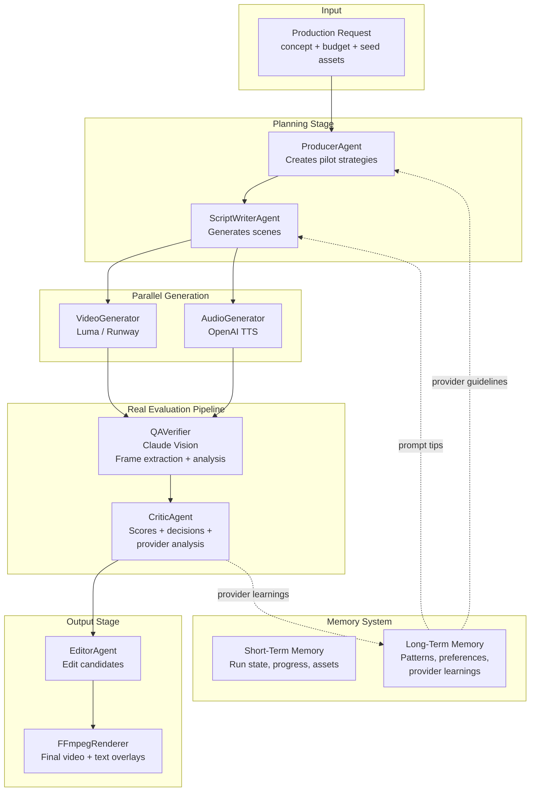

# Claude Studio Producer

> Budget-aware multi-agent video production with AI orchestration. Manages competitive pilots, real video generation with Luma AI, vision-based QA analysis, and self-improving provider learnings.

## Developer Notes

### Jan 9, 2026

#### What's Working Now

- **Real video generation** with Luma AI (image-to-video) and Runway (implemented); several other providers are stubbed out
- **Vision-based QA** using Claude to analyze extracted video frames
- **Provider learning system** that improves prompts over time
- **Web dashboard** to view runs, preview videos, and see QA scores
- **CLI tool** with live progress and detailed feedback

#### What is this even for?

I wanted to make a demo project that 1) shows off what you can do pretty quickly with Claude; 2) how to design and implement a working multi-agent workflow; 3) use learning/memory; 4) use rewards; and 5) have fun.

If you're curious about the design aspect, there are a bunch of [spec docs](docs/specs) and you can look at their timestamps to get a rough idea of the layering of the features. Well, I/we (me & the Claudes) did a lot in two days, let's just say that.

I used Claude.ai with Opus 4.5 from my mobile phone to start... using the microphone to dictate my pitch about the project from some [hastily scribbled notes on my notepad](examples/inputs/notebook-on-a-notebook.jpg). This got us our first specs. 

I'm actually on a new computer at home - Windows - because 1) I bought it to play some newer games with friends and 2) in theory it is fast enough to dev on, but I'm used to a Mac at work. Anyways, Claude on the web helped me get this laptop going with VS Code, Gitbash, Docker, Claude extension for VS Code, etc so I could actually dev on this machine. So now I have two Claudes. Claude Code (CC) in my IDE, and Claude "prime or planner?" (CP) that knows my project plan. I keep CP in the loop of the progress and he's the one that generates new specs or detailed prompts for CC. It's really about context management: IYKYK. CC chews through context and is constantly compressing, so it's not the best place to monitor your overall project progress. Also CC can chase its tail, so it is good to have CP around to help correct things.

**How is this fun?**
I've been interested in making "derivative content" for quite a while. Content that I would like to see that doesn't exist yet. I experimented and launched a little [news site](https://spiritwriter.ai) that uses an LLM to assess bias in news and rate it, then generate two variants: a hard left (0.2) and a hard right (0.8) where bias is 0 to 1, left to right. Then because I really love NotebookLM but didn't like waiting for their renders, I made a [podcasts site](https://podcasts.spiritwriter.ai) where I could define my interests and it would automatically download the latest scientific articles that matched and create a podcast talking about it, so every morning I'd have 3 new specially curated science-based podcasts on the hottest publications. Pretty cool, but also a bit expensive. I paused that one and now I have a journalclub subscription that sort of scratches that particular itch.

Now full circle. Why not create a virtual studio where you've got a producer who can take your budget and your pitch and craft pilots based on what he knows works and what you can afford? Then the producer hires a script writer agent and provides the guidelines for the kind of pilot to make. The script writer makes the various scenes know what it knows about the provider, like how long the clips can be and what they excel or fail at. The scenes get shot by a Video Generator agent (and the GenAI provider and be parallelized), then these come back to QA agents (this can be parallelized) for a technical review. The reports for each clip are provided to the Critic agent who looks at the original script and assesses the overall quality of the collection of clips and makes recommendations to the Editor agent who then creates an Edit Decision List (EDL) for the final candidate videos.

**Are we having fun yet?**
I thought putting a feedback loop in where the agents store learning in memory for the producer and script writer to leverage would be a great idea. And the budget aspect helps keep a lid on costs so you can do re-runs, but only on promising arcs, and only within your budget. Studio reinforcement learning. StudioRL. There, I made something up. Enjoy!


**Prompt:**
*A 15-second story of a developer having a breakthrough: Scene 1 - Wide shot of developer at desk in cozy home office at night, hunched over laptop, frustrated expression, warm desk lamp lighting. Scene 2 - They lean back with a satisfied smile, stretch arms up in victory celebration, coffee cup visible nearby, cinematic triumph moment.* 

**Result:** make it rain coffee...!

### Jan 10, 2026

**Reflections about API drift**
Reflecting on some of the challenges that I had with the project: API drift is the most obvious one out of the gate. Claude was trained on these APIs a while back and with only one exception it had the signatures wrong. It created the script writer and scene analysis hooks with the Anthropic API without batting an eye. After some initial thrashing with the Runway API, I modified the dev pattern to first validate the API calls, create a test framework and start building the CLI, so I could more easily participate in testing in parallel while Claude Code was grinding away on some task. Onboarding the next API, Luma, had almost no thrashing. 

**Provider profiling and timeouts**
There was one point at 12AM sharp when my Luma calls started timing out. I had a default 300s timeout and most of my multi-scene runs were still getting done in 60-120 seconds, so this was both a frustration and worry. Thankfully, I'd created a `claude-studio test-provider luma` CLI call that bypasses the complex agent pipeline and does native API calls. It also timed out, so I was relieved I hadn't introduced a regression and given the timing I figured Luma probably has some batch job running in the middle of the night causing some queuing for customers like me burning the midnight oil. So advice to my future self or anyone else adding in new providers (like an image or audio service), always get the test rig dialed in before you start making calls that cost money. Why? Because I realized the next morning that while my side timed out, Luma queued me. Those runs finished eventually and so for every frustrated key press where I submitted another job that would time out, I was also ringing the register. So the next morning I implemented a `--timeout` parameter, so I not only doubled Luma's default timeout, but I could adjust it dynamically because some of my prompts were resulting in 8 scene runs which obviously will take longer.

**Parallelism**
This brings forward the question of parallelism in the runs. It seemed obvious in the design phase that I'd want to establish the scene plans from the script writer and execute those in parallel to whatever limit the provider would accept. So the provider model is evolving as you onboard each one - you learn a little about their queuing patterns, scheduled server loads (12 am not a great time), and how many parallel jobs you can run before you get rate limited. Note to self: add this... `test-provider scale` so I can verify when I get rate limited. This informs the job plan and expected timeout. At the end of the day though, at least for Luma, I figured out that parallelism wasn't as important as passing keyframes from one video to the next to maintain narrative consistency. Simply put in an example, you ask for 3 scenes about "a person working at a computer then celebrating", and you get 1st scene with a white male actor, a middle scene with an asian woman, and the last one with someone who might be similar to the first, but you can't tell. The narrative is ruined because even if you're super specific about the description of the actor, the LLM is going to be creative. So unless the provider is really good about using a seed input and keeping that "actor" in mind, you're going to need to produce linearly so you can sample then seed as you go.  

**Orphan harvesting**
Then there's orphan harvesting. This sounds terrible, I know. Help me find a better term, Claude!? I had several videos on Lumas' CDN that were from my midnight runs that timed out. While I had resuming sessions in the back of my mind I hadn't considered having to resume and fetch orphaned artifacts. I chalked this up to how many clips end up "on the cutting room floor". This is studio speak for the editing process in making a movie that leaves a lot of content, or in this archaic reference, cut pieces of film, left as trash on the floor. This old film would be recycled since it had silver in it. In our digital world though, each clip has metadata like provenance and critic comments. It has value and can likewise be recycled in testing and perhaps even get its day in another sequence that finds that clip more at home. Orphan harvesting with a silver lining?

**Learning loop analysis**
While I hope that my failures can somehow be useful later, I wasn't *entirely* sure that the feedback look that I incorporated was actually working. I was getting some better results run after run, but part of that was Claude having some context and curating some of my test incantations. The script writer agent is quite good at creating depth and detail in each envisioned scene and we could see Luma outright ignoring many of the details. Somewhere between my initial input, the screen writer's learnings from previous runs, and Luma's interpretations is some signal of improvement. Maybe. 

So I asked for an experiments module that I could use to analyze the data, help define experiments, and analyze the results. Then potentially tune how the memories are collected, learning extracted, and prompting/planning is influenced.

I wanted a high-level report.

```
============================================================
CLAUDE STUDIO PRODUCER - LEARNING LOOP ANALYSIS
============================================================

📊 OVERVIEW
   Total runs analyzed: 5
   Total scenes: 12
   Provider learnings recorded: 3

📈 QUALITY TREND
   Trend: IMPROVING
   First 3 runs avg: 65.2
   Last 3 runs avg: 78.4
   Overall avg: 71.8

⚠️  COMPLEXITY ANALYSIS (Racing to Bottom Check)
   Racing to bottom: NO ✓
   Achievability trend: +1.2/run
   Word count trend: -2.3/run

🧠 LEARNING STATISTICS
   luma:
      Learnings recorded: 3
      Avg adherence: 72.0
      Success rate: 67%
```

Also some intent analysis.
```
============================================================
INTENT PRESERVATION ANALYSIS
============================================================

📝 Original: A 15-second story of a developer having a breakthrough...
📝 Generated: Close-up of person at desk, neutral expression...

📊 SCORES
   Overall Preservation: 35%
   Overall Achievability: 85%
   Balance Score: 55

🔍 DIMENSIONS
   ⚠️ Semantic: 25%
      Lost: developer, breakthrough, story
   ⚠️ Emotional: 0%
      Lost: frustrated, triumphant
   ✓ Visual: 80%
   ⚠️ Narrative: 20%
      Lost: 15-second, journey

🚦 STATUS
   ⚠️  RACING TO BOTTOM - Prompt over-simplified!

💡 SUGGESTIONS
   ⚠️ RACING TO BOTTOM DETECTED
   The prompt has been over-simplified. Consider:
     - Restore semantic elements: developer, breakthrough, story
     - Restore emotional tone: frustrated, triumphant
     - Use more descriptive language while keeping visuals concrete
```

A chief concern is something like overfitting, or what I'm calling a race to the bottom. If I have to keep similifying the prompt to get better alignment, how far way from the original intent am I?

The good news is that the feedback system works - to a degree. We'll just have to implement a smarter memory system and adjust how feedback is incorporated in subsequent runs.

## Quick Start

```bash
# Clone and install
git clone https://github.com/aaronmarkham/claude-studio-producer.git
cd claude-studio-producer
pip install -e ".[server]"

# Set up API keys
cp .env.example .env
# Add ANTHROPIC_API_KEY and LUMA_API_KEY

# Run a production (mock mode - no API costs)
python -m cli.produce "A serene mountain lake at sunset" --budget 5

# Run with real video generation
python -m cli.produce "A serene mountain lake at sunset" --budget 5 --live
```

## Architecture



## Features

### CLI with Live Progress

```bash
# Basic production
python -m cli.produce "Product demo for mobile app" --budget 10

# With seed image (image-to-video)
python -m cli.produce "Animate this logo" --budget 5 --seed logo.png

# Live mode with real generation
python -m cli.produce "Tech startup intro" --budget 15 --live --provider luma
```

The CLI shows:
- Real-time agent progress
- QA scores per scene (Visual, Style, Technical, Narrative)
- Issues found and suggestions
- Provider learnings extracted

### Custom Scene Combinations

After a production run, create custom edits by combining specific scenes:

```bash
# List available scenes from a run
python -m cli.combine 20260109_080534 --list

# Combine scenes 1 and 3 (skipping scene 2)
python -m cli.combine 20260109_080534 --scenes 1,3

# Combine with custom output name
python -m cli.combine 20260109_080534 --scenes 1,3,5 -o highlight_reel.mp4
```

This is useful when:
- Some scenes have different actors/styles you want to exclude
- Creating alternate cuts or highlight reels
- Manual override of the automated EDL

### Web Dashboard

```bash
# Start the server
python -m server.main

# Open http://localhost:8000
```

View all runs, preview generated videos, and inspect QA scores.

### Real QA with Claude Vision

When using `--live` mode, the QA system:
1. Extracts frames from generated videos using ffmpeg
2. Sends frames to Claude Vision for analysis
3. Scores on 4 dimensions (0-100 each):
   - **Visual Accuracy**: Do visuals match the scene description?
   - **Style Consistency**: Does it match the production tier?
   - **Technical Quality**: Any artifacts, blur, or issues?
   - **Narrative Fit**: Does it work in the overall story?
4. Records issues and improvement suggestions

### Provider Learning (Self-Improving)

The system learns from every run:

```
Run 1: "magical transformation effect" -> Score: 45
  -> Learning: "Luma struggles with VFX transformations"
  -> Added to avoid_list

Run 2: System avoids VFX, uses "slow camera pan" -> Score: 88
  -> Learning: "Detailed physical descriptions work well"
  -> Added to prompt_guidelines

Run 3+: Better prompts, higher scores
```

Learnings are stored in `artifacts/memory.json` and used to improve future runs.

## Screenshots

### CLI Production Stages

The CLI shows real-time progress through each stage of production:

**Stage 1: Planning** - Producer creates pilot strategy, ScriptWriter generates scenes


**Stage 2: Generation** - Video generation with Luma AI


**Stage 3: QA & Evaluation** - Claude Vision analyzes frames, Critic extracts learnings


**Stage 4: Output** - Editor creates EDL, Renderer produces final video


### Generated Videos

Example outputs from Luma AI image-to-video generation:

| Pencil Animation | Keyboard Animation |
|------------------|-------------------|
|  |  |

### Provider Learnings

The system accumulates learnings from each run to improve future prompts:


## Agents

| Agent | Status | Description |
|-------|--------|-------------|
| **ProducerAgent** | Implemented | Analyzes requests, creates pilot strategies using provider knowledge |
| **ScriptWriterAgent** | Implemented | Breaks concepts into scenes, applies learned prompt guidelines |
| **VideoGeneratorAgent** | Implemented | Generates video with Luma AI (real) or mock providers |
| **QAVerifierAgent** | Implemented | Vision-based quality analysis with Claude |
| **CriticAgent** | Implemented | Evaluates results, extracts provider learnings |
| **EditorAgent** | Implemented | Creates EDL candidates for final assembly |
| **AudioGeneratorAgent** | Stub | Audio generation (interface ready) |
| **AssetAnalyzerAgent** | Stub | Seed asset analysis with Claude Vision |

## Providers

| Provider | Status | Notes |
|----------|--------|-------|
| **Luma AI** | Implemented | Image-to-video, real API integration |
| Runway ML | Stub | Interface + cost model ready |
| Pika Labs | Stub | Interface + cost model ready |
| Kling AI | Stub | Interface + cost model ready |

## Project Structure

```
claude-studio-producer/
├── agents/                 # Agent implementations
│   ├── producer.py         # Pilot strategy creation
│   ├── script_writer.py    # Scene generation with provider guidelines
│   ├── video_generator.py  # Video generation orchestration
│   ├── qa_verifier.py      # Real vision-based QA
│   ├── critic.py           # Evaluation + provider learning extraction
│   └── editor.py           # EDL generation
│
├── cli/
│   ├── produce.py          # Main CLI with --live mode
│   └── luma.py             # Luma testing CLI
│
├── core/
│   ├── claude_client.py    # Claude SDK wrapper with vision support
│   ├── budget.py           # Cost models and tracking
│   ├── renderer.py         # FFmpeg video rendering
│   ├── memory/             # Memory system
│   │   ├── manager.py      # MemoryManager (STM + LTM)
│   │   └── bootstrap.py    # Provider knowledge seeding
│   ├── models/
│   │   └── memory.py       # ProviderKnowledge, ProviderLearning, etc.
│   └── providers/
│       └── video/
│           ├── luma.py     # Real Luma AI integration
│           └── ...         # Other provider stubs
│
├── server/
│   ├── main.py             # FastAPI server
│   ├── routes/
│   │   ├── runs.py         # Run list and preview API
│   │   └── memory.py       # Memory/LTM API
│   └── templates/          # Dashboard HTML templates
│
├── docs/
│   ├── architecture_current.md    # Current system diagram
│   ├── architecture_future_strands.md  # Future Strands memory integration
│   └── specs/              # Detailed specifications
│
└── artifacts/              # Run outputs
    ├── memory.json         # LTM with provider learnings
    └── runs/               # Per-run data and videos
```

## Configuration

```bash
# .env file
ANTHROPIC_API_KEY=sk-ant-...    # Required
LUMA_API_KEY=luma-...           # For live video generation
RUNWAY_API_KEY=...              # For Runway provider (optional)
```

## Development

```bash
# Install dev dependencies
pip install -e ".[dev,server]"

# Run tests
pytest

# Start server with auto-reload
uvicorn server.main:app --reload
```

## Roadmap

### Completed
- [x] Multi-agent orchestration with Strands
- [x] Real video generation (Luma AI)
- [x] Vision-based QA with Claude
- [x] Provider learning system (LTM)
- [x] Web dashboard
- [x] CLI with live progress
- [x] FFmpeg rendering

### In Progress
- [ ] Strands native memory integration (currently custom JSON)
- [ ] Audio generation pipeline
- [ ] Additional video providers (Runway, Pika)

### Future
- [ ] Semantic search over memories
- [ ] Multi-pilot competitive generation
- [ ] Audio-video synchronization
- [ ] S3 storage integration

## License

MIT-0 (MIT No Attribution) - see [LICENSE](LICENSE)

## Links

- [GitHub Issues](https://github.com/aaronmarkham/claude-studio-producer/issues)
- [Architecture Docs](docs/)
