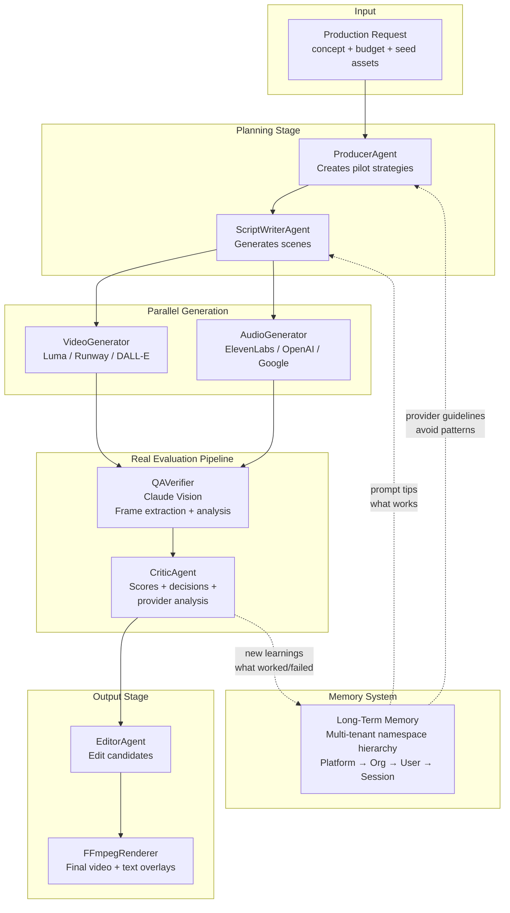
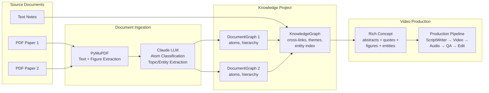
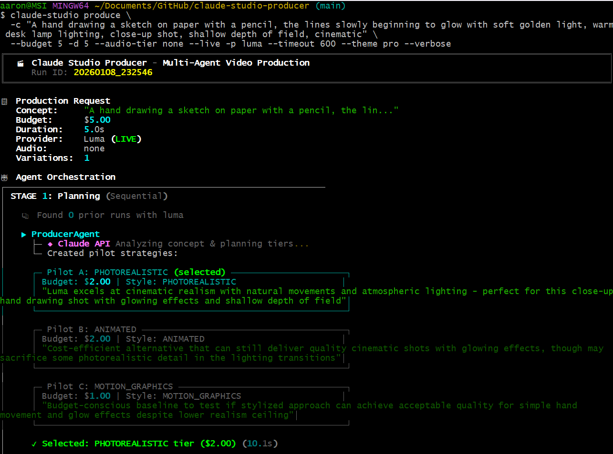
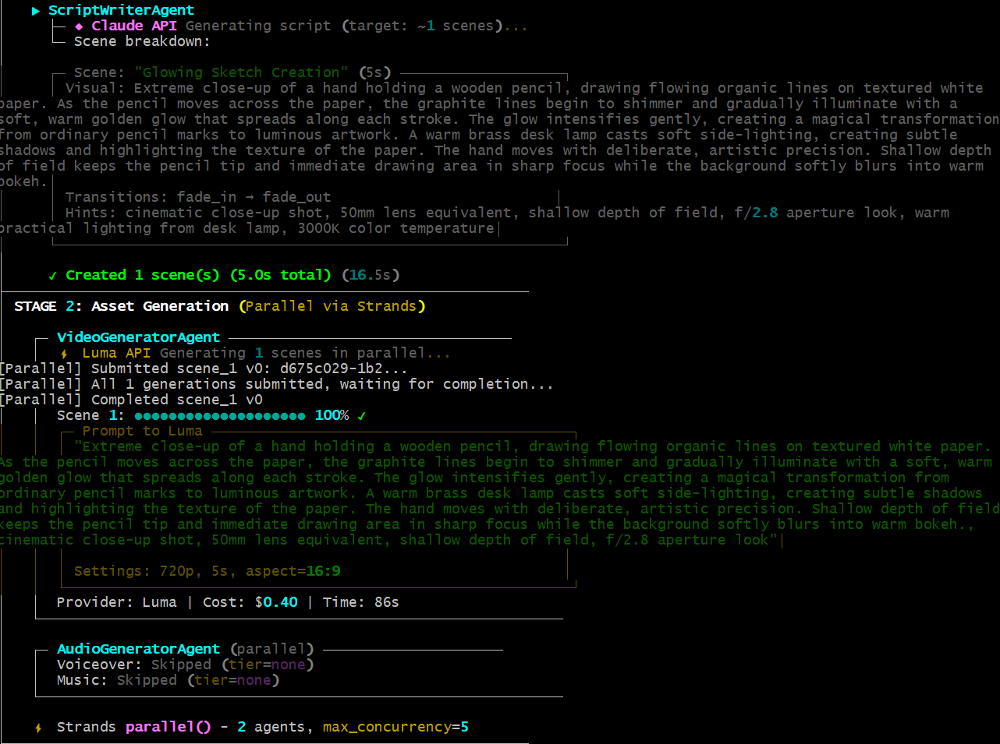
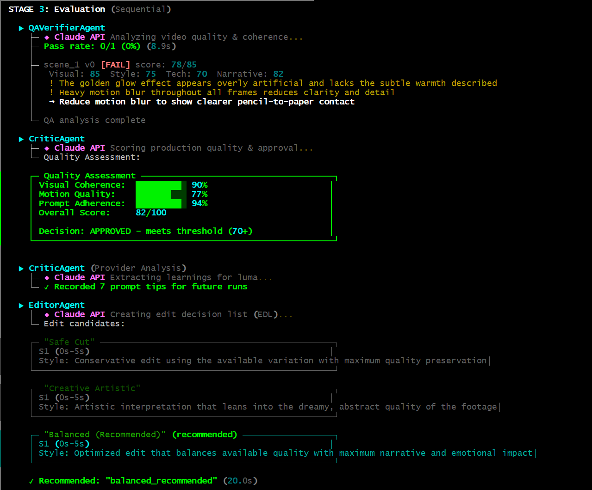
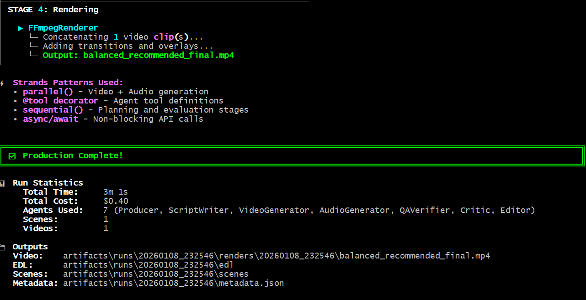
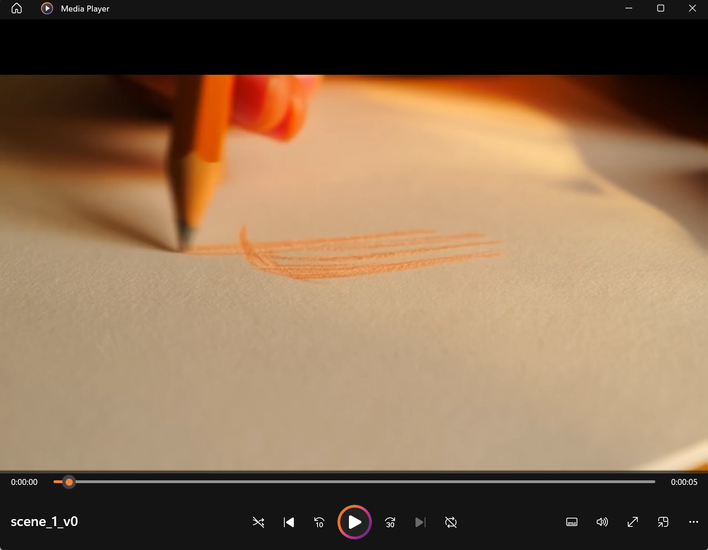
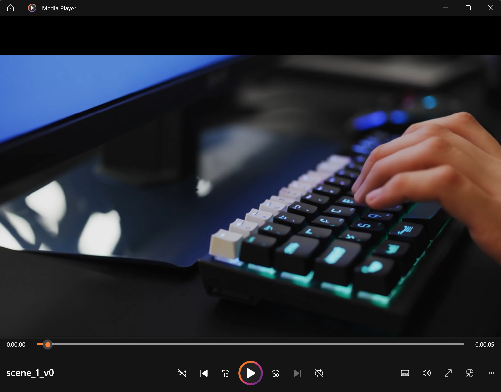
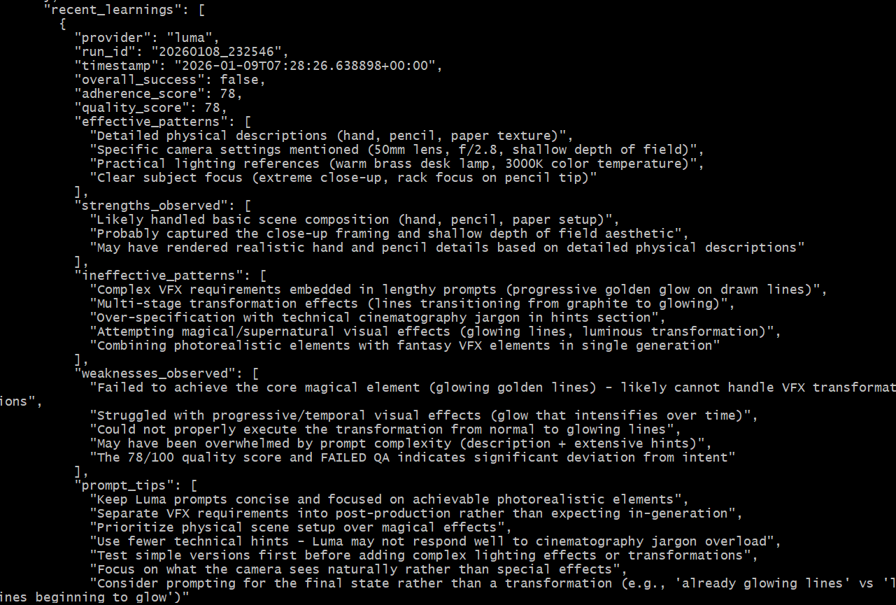

# Claude Studio Producer

> Budget-aware multi-agent video production with AI orchestration. Manages competitive pilots, real video generation with Luma AI, image generation with DALL-E, text to audio generation with ElevenLabs, vision-based QA analysis, and self-improving provider learnings.

## Features
1. Learning system - as you use it, it gets smarter
2. Provider onboarding - it is an agent that reads documentation and creates implementations and tests that can use whatever that new thing can do (like a new image/audio generator or data source like pdfs or stats), and yes, this uses the learning system
3. Knowledge base - content sourced from things like scientific journals are atomized, graphed, and then usable assets for your videos
4. Multi-tenant memory - secure, share, and manage your memories by adjusting their scope
5. Scale your agents - deploy graph, swarm, or mixes of the two to go parallel or use the outputs of one part of the workflow for other parts of the workflow

## Tech stack
1. Claude (obviously)
2. Strands SDK (for agent workflows and scaling)
3. Click and Rich (for the CLI)
4. FFmpeg (for video rendering)

**Optional**
* lumaai (you can use other [providers](docs/providers.md))
* pymupdf (if you want pdf source material)
* jinja2 (if you want to use the dashboard)
* Amazon Bedrock AgentCore (if you want to host the long term memory and run agents on their platform; agents are locally run by default)

## Vision
I wanted to make a demo project that 1) shows off what you can do pretty quickly with Claude; 2) how to design and implement a working multi-agent workflow; 3) use learning/memory; 4) use rewards; and 5) have fun.

If you're curious about the design aspect, there are a bunch of [spec docs](docs/specs) and you can look at their timestamps to get a rough idea of the layering of the features. Well, I/we (me & the Claudes) did a lot in two days, let's just say that. I started this January 9th, and

[Read more about the project in my developer notes](docs/dev_notes.md)

## Prerequisites

**System Requirements:**
- Python 3.11+
- FFmpeg (required for video/audio processing)

**Install FFmpeg:**
```bash
# macOS
brew install ffmpeg

# Ubuntu/Debian
sudo apt install ffmpeg

# Windows
choco install ffmpeg
# Or download from https://ffmpeg.org/download.html
```

Verify installation:
```bash
ffmpeg -version
```

## Quick Start

```bash
# Clone and install
git clone https://github.com/aaronmarkham/claude-studio-producer.git
cd claude-studio-producer
pip install -e ".[server]"

# Set up API keys securely with OS keychain
claude-studio secrets set ANTHROPIC
claude-studio secrets set LUMA

# Or use environment variables
cp .env.example .env
# Add ANTHROPIC_API_KEY and LUMA_API_KEY

# Run a production (mock mode - no API costs)
claude-studio produce "A serene mountain lake at sunset" --budget 5

# Run with real video generation
claude-studio produce "A serene mountain lake at sunset" --budget 5 --live --provider luma
```

## Architecture



### Multi-Tenant Memory System

The memory system uses a hierarchical namespace structure for learnings:

```
PROVIDER LEARNING LIFECYCLE
============================

1. ONBOARDING (one-time per provider)
   ┌─────────────────┐
   │  API Docs       │──► Onboarding ──► tips, gotchas, limitations
   │  Stub File      │    Agent          │
   └─────────────────┘                   │
                                         ▼
2. STORAGE (namespace hierarchy)      ┌─────────┐
                                      │  USER   │ ◄── initial home
   ┌──────────────────────────────────┴─────────┴──────────────────┐
   │                                                               │
   │   SESSION (0.5)  ──►  USER (0.65)  ──►  ORG (0.8)  ──►  PLATFORM (1.0)
   │   experimental       validated         team-wide       curated
   │                          ▲                 ▲
   │                          │                 │
   │                     promote if         promote if
   │                     works well        cross-team value
   └───────────────────────────────────────────────────────────────┘

3. PRODUCTION (ongoing)
   ┌─────────────────┐      ┌─────────────┐      ┌─────────────┐
   │  ScriptWriter   │◄─────│   merged    │◄─────│  all tiers  │
   │  (uses tips)    │      │  learnings  │      │  by priority│
   └────────┬────────┘      └─────────────┘      └─────────────┘
            │
            ▼
   ┌─────────────────┐
   │  Video/Audio    │──► actual generation
   │  Generation     │
   └────────┬────────┘
            │
            ▼
   ┌─────────────────┐      ┌─────────────┐
   │  Critic Agent   │──────│   SESSION   │──► new learnings
   │  (evaluates)    │      │   memory    │    (what worked/failed)
   └─────────────────┘      └─────────────┘
```

**Key Features:**
- **Priority-based retrieval**: Platform learnings override org, org overrides user
- **Automatic promotion**: Learnings can be promoted up the hierarchy based on validation count
- **CLI management**: `claude-studio memory` commands for viewing, adding, and managing learnings
- **Categories**: avoid, prefer, tip, pattern - for different types of provider knowledge

## Features

### CLI with Live Progress

```bash
# Basic production
python -m cli.produce "Product demo for mobile app" --budget 10

# With seed image (image-to-video)
python -m cli.produce "Animate this logo" --budget 5 --seed logo.png

# Live mode with real generation
python -m cli.produce "Tech startup intro" --budget 15 --live --provider luma
```

The CLI shows:
- Real-time agent progress
- QA scores per scene (Visual, Style, Technical, Narrative)
- Issues found and suggestions
- Provider learnings extracted

### Custom Scene Combinations

After a production run, create custom edits by combining specific scenes:

```bash
# List available scenes from a run
python -m cli.combine 20260109_080534 --list

# Combine scenes 1 and 3 (skipping scene 2)
python -m cli.combine 20260109_080534 --scenes 1,3

# Combine with custom output name
python -m cli.combine 20260109_080534 --scenes 1,3,5 -o highlight_reel.mp4
```

This is useful when:
- Some scenes have different actors/styles you want to exclude
- Creating alternate cuts or highlight reels
- Manual override of the automated EDL

### Knowledge Base (Multi-Source Document Production)

Create videos from research papers, documents, and notes with automatic knowledge extraction:

```bash
# Create a knowledge project
claude-studio kb create "AI Research" -d "Papers on neural networks"

# Add a PDF paper (uses Claude for intelligent atom extraction)
claude-studio kb add "AI Research" --paper paper.pdf

# Add with mock mode (faster, no LLM costs)
claude-studio kb add "AI Research" --paper paper.pdf --mock

# View project summary
claude-studio kb show "AI Research" --graph

# Produce video from knowledge base
claude-studio kb produce "AI Research" \
  -p "Explain the key findings and methodology" \
  --style podcast \
  --duration 120 \
  --mock
```

**Features:**
- **Document ingestion**: Extracts atoms (paragraphs, figures, tables, equations) with PyMuPDF
- **LLM classification**: Claude categorizes atoms by type and extracts topics/entities
- **Knowledge graph**: Builds cross-document connections via shared entities
- **Rich concept generation**: Assembles KB content into detailed prompts for ScriptWriter



### Narrative Styles

Control how verbose and conversational your scripts are:

```bash
# Brief visual storyboard (default) - ~20-30 words per scene
claude-studio produce -c "Product demo" --style visual_storyboard

# Rich podcast narrative (NotebookLM-style) - ~100 words per scene
claude-studio produce -c "Explain quantum computing" --style podcast

# Educational lecture format - ~80-120 words per scene
claude-studio produce -c "Tutorial on React hooks" --style educational

# Documentary with gravitas - ~60-100 words per scene
claude-studio produce -c "History of the internet" --style documentary
```

| Style | Words/Scene | Best For |
|-------|-------------|----------|
| `visual_storyboard` | ~20-30 | Product demos, ads, visual-first content |
| `podcast` | ~85-100 | Explainers, research summaries, educational deep-dives |
| `educational` | ~80-120 | Tutorials, lectures, learning content |
| `documentary` | ~60-100 | Narratives, historical content, storytelling |

### Podcast Training Pipeline

Train the system to generate high-quality podcast scripts from research papers using an ML-style iterative approach:

```bash
# Run a training trial on a knowledge base project
claude-studio training run uav-positioning \
  --reference-audio ref_podcast.mp3 \
  --reference-transcript ref_transcript.txt

# View training results
claude-studio training show trial_000_20260205

# List all training trials
claude-studio training list
```

The training pipeline:
1. **Transcribes** reference podcasts using Whisper
2. **Classifies segments** (INTRO, BACKGROUND, METHODOLOGY, KEY_FINDING, etc.)
3. **Extracts style profiles** (vocabulary, pacing, conversation dynamics)
4. **Synthesizes learnings** for improved script generation
5. **Runs iterative trials** to optimize quality

### Video Production from Training

Create explainer videos from training outputs with budget-aware visual generation:

```bash
# Show budget tier costs for a training trial
claude-studio produce-video -t trial_000_20260205 --show-tiers

# Produce with low budget (hero images only)
claude-studio produce-video -t trial_000_20260205 --budget low --mock

# Produce with KB figures and live generation
claude-studio produce-video -t trial_000_20260205 --budget medium --kb uav-research --live

# Incremental production (first 5 scenes)
claude-studio produce-video -t trial_000_20260205 --budget medium --limit 5 --live
```

**Budget Tiers:**

| Tier | DALL-E Images | Luma Animations | Estimated Cost |
|------|---------------|-----------------|----------------|
| `micro` | 0 (text only) | 0 | $0 |
| `low` | ~15 hero images | 0 | $1-2 |
| `medium` | ~40 consolidated | 0 | $3-5 |
| `high` | ~80 images | 5 selective | $8-12 |
| `full` | All scenes | All candidates | $15+ |

The system uses **scene importance scoring** to allocate limited image budgets to the most impactful moments (KEY_FINDING, METHODOLOGY, FIGURE_DISCUSSION).

### Production Modes

Claude Studio Producer supports two production workflows that determine which asset drives the timeline:

#### Audio-Led Production (Podcast, Educational, Documentary)
In audio-led mode, the audio narration drives the timeline. Videos are generated or adjusted to match the audio duration. Perfect for:
- Podcast-style narratives
- Educational content with precise voiceover
- Documentary-style productions

```bash
# Audio-led production (auto-detected from style)
claude-studio produce "Explain quantum computing" --style podcast --budget 5 --live

# Or explicitly set mode
claude-studio produce "Tutorial on Python decorators" --mode audio-led --budget 5 --live
```

#### Video-Led Production (Visual Storyboard, Cinematic)
In video-led mode, the video drives the timeline. Audio is generated to match video duration. Perfect for:
- Visual-first storytelling
- Cinematic sequences
- Image-to-video pipelines

```bash
# Video-led production (default for visual styles)
claude-studio produce "Cinematic coffee commercial" --style visual_storyboard --budget 5 --live
```

#### Automatic Audio-Video Mixing
The production pipeline automatically:
1. Generates video for each scene
2. Generates audio narration for each scene
3. Mixes video + audio using FFmpeg with appropriate fit modes
4. Concatenates all scenes into final output (`artifacts/<run_id>/final_output.mp4`)

No manual mixing required! The system handles synchronization based on your chosen production mode.

**Fit Modes** (for duration mismatches):
- `stretch`: Speed-adjust video to match audio (default for audio-led)
- `truncate`: Trim longer asset to match shorter
- `loop`: Loop shorter asset to match longer

### Web Dashboard

```bash
# Start the server
python -m server.main

# Open http://localhost:8000
```

View all runs, preview generated videos, and inspect QA scores.

### Real QA with Claude Vision

When using `--live` mode, the QA system:
1. Extracts frames from generated videos using ffmpeg
2. Sends frames to Claude Vision for analysis
3. Scores on 4 dimensions (0-100 each):
   - **Visual Accuracy**: Do visuals match the scene description?
   - **Style Consistency**: Does it match the production tier?
   - **Technical Quality**: Any artifacts, blur, or issues?
   - **Narrative Fit**: Does it work in the overall story?
4. Records issues and improvement suggestions

### Provider Learning (Self-Improving)

The system learns from every run:

```
Run 1: "magical transformation effect" -> Score: 45
  -> Learning: "Luma struggles with VFX transformations"
  -> Added to avoid_list

Run 2: System avoids VFX, uses "slow camera pan" -> Score: 88
  -> Learning: "Detailed physical descriptions work well"
  -> Added to prompt_guidelines

Run 3+: Better prompts, higher scores
```

Learnings are stored in the multi-tenant memory system (`artifacts/memory/`) and used to improve future runs. Use `claude-studio memory list luma` to see current learnings.

## Screenshots

### CLI Production Stages

The CLI shows real-time progress through each stage of production:

**Stage 1: Planning** - Producer creates pilot strategy, ScriptWriter generates scenes



**Stage 2: Generation** - Video generation with Luma AI



**Stage 3: QA & Evaluation** - Claude Vision analyzes frames, Critic extracts learnings



**Stage 4: Output** - Editor creates EDL, Renderer produces final video



### Generated Videos

Example outputs from Luma AI image-to-video generation:

| Pencil Animation | Keyboard Animation |
|------------------|-------------------|
|  |  |

### Provider Learnings

The system accumulates learnings from each run to improve future prompts:



## Agents

| Agent | Status | Description |
|-------|--------|-------------|
| **ProducerAgent** | Implemented | Analyzes requests, creates pilot strategies using provider knowledge |
| **ScriptWriterAgent** | Implemented | Breaks concepts into scenes, applies learned prompt guidelines |
| **VideoGeneratorAgent** | Implemented | Generates video with Luma AI (real) or mock providers |
| **QAVerifierAgent** | Implemented | Vision-based quality analysis with Claude |
| **CriticAgent** | Implemented | Evaluates results, extracts provider learnings |
| **ProviderOnboardingAgent** | Implemented | Analyzes API docs, generates provider implementations, validates with tests |
| **EditorAgent** | Implemented | Creates EDL candidates for final assembly |
| **AudioGeneratorAgent** | Implemented | TTS voiceover generation with ElevenLabs/OpenAI |
| **DocumentIngestorAgent** | Implemented | PDF ingestion, atom extraction, LLM classification |
| **AssetAnalyzerAgent** | Stub | Seed asset analysis with Claude Vision |

## Providers

### Video Providers

| Provider | Status | Notes |
|----------|--------|-------|
| **Luma AI** | Implemented | Image-to-video, text-to-video, scene chaining |
| Runway ML | Stub | Interface + cost model ready |
| Pika Labs | Stub | Interface + cost model ready |
| Kling AI | Stub | Interface + cost model ready |

### Audio Providers (TTS)

| Provider | Status | Notes |
|----------|--------|-------|
| **ElevenLabs** | Implemented | High-quality TTS, 29 languages, voice cloning |
| **OpenAI TTS** | Implemented | 6 voices, fast generation |
| **Google TTS** | Implemented | Neural2/WaveNet/Studio voices, 75+ languages |
| Inworld | Stub | Interface ready |

### Image Providers

| Provider | Status | Notes |
|----------|--------|-------|
| **DALL-E** | Implemented | DALL-E 2 & 3, seed images, thumbnails |
| Midjourney | - | Not planned (no API) |
| Stability | Stub | Interface ready |

[Read more about providers](docs/providers.md)

## Project Structure

```
claude-studio-producer/
├── agents/                 # Agent implementations
│   ├── producer.py         # Pilot strategy creation
│   ├── script_writer.py    # Scene generation with provider guidelines
│   ├── video_generator.py  # Video generation orchestration
│   ├── qa_verifier.py      # Real vision-based QA
│   ├── critic.py           # Evaluation + provider learning extraction
│   └── editor.py           # EDL generation
│
├── cli/
│   ├── produce.py          # Main CLI with --live mode and --style
│   ├── produce_video.py    # Transcript-led video production with budget tiers
│   ├── training.py         # Podcast training pipeline CLI
│   ├── kb.py               # Knowledge base management CLI
│   └── luma.py             # Luma testing CLI
│
├── core/
│   ├── claude_client.py    # Claude SDK wrapper with vision support
│   ├── budget.py           # Cost models and tracking
│   ├── renderer.py         # FFmpeg video rendering
│   ├── memory/             # Memory system
│   │   ├── manager.py      # MemoryManager (STM + LTM)
│   │   └── bootstrap.py    # Provider knowledge seeding
│   ├── models/
│   │   ├── memory.py       # ProviderKnowledge, ProviderLearning, etc.
│   │   ├── knowledge.py    # KnowledgeProject, KnowledgeGraph, KnowledgeSource
│   │   └── document.py     # DocumentGraph, DocumentAtom, AtomType
│   └── providers/
│       └── video/
│           ├── luma.py     # Real Luma AI integration
│           └── ...         # Other provider stubs
│
├── server/
│   ├── main.py             # FastAPI server
│   ├── routes/
│   │   ├── runs.py         # Run list and preview API
│   │   └── memory.py       # Memory/LTM API
│   └── templates/          # Dashboard HTML templates
│
├── docs/
│   └── specs/              # Detailed specifications
│       ├── MULTI_TENANT_MEMORY_ARCHITECTURE.md  # Memory system design
│       └── ...             # Other specs
│
└── artifacts/              # Run outputs
    ├── memory.json         # LTM with provider learnings
    └── runs/               # Per-run data and videos
```

## Configuration

```bash
# .env file
ANTHROPIC_API_KEY=sk-ant-...    # Required
LUMA_API_KEY=luma-...           # For live video generation
RUNWAY_API_KEY=...              # For Runway provider (optional)
```

## Development

```bash
# Install dev dependencies
pip install -e ".[dev,server]"

# Run tests
pytest

# Start server with auto-reload
uvicorn server.main:app --reload
```

## Roadmap

### Completed
- [x] Multi-agent orchestration with Strands
- [x] Real video generation (Luma AI)
- [x] Vision-based QA with Claude
- [x] Provider learning system (LTM)
- [x] Web dashboard
- [x] CLI with live progress
- [x] FFmpeg rendering
- [x] Multi-tenant memory system with namespace hierarchy
- [x] Memory CLI (`claude-studio memory` commands)
- [x] Learning promotion system (session → user → org → platform)
- [x] Provider onboarding agent with auto-test and session resume
- [x] ElevenLabs TTS integration (voice selection, streaming, voice settings)
- [x] OpenAI TTS integration
- [x] Knowledge base system (`kb` CLI for multi-source document management)
- [x] Document ingestion with figure extraction (PyMuPDF + Claude)
- [x] Configurable narrative styles (podcast, educational, documentary)
- [x] DALL-E image generation provider
- [x] Google Cloud TTS provider (Neural2, WaveNet, Studio voices)
- [x] Runway ML video provider (image-to-video)
- [x] Multi-provider pipeline (e.g., DALL-E image → Runway video)
- [x] Audio-video synchronization and mixing (Audio-led and video-led modes with automatic pipeline)
- [x] Video/audio mixing and rendering with volume control
- [x] Podcast training pipeline (ML-style iterative improvement with reference podcasts)
- [x] Transcript-led video production (`produce-video` CLI with budget tiers)
- [x] Scene importance scoring for budget-aware image allocation
- [x] KB figure integration (use extracted PDF figures in videos)
- [x] Claude Code skills integration (progressive disclosure with `/produce`, `/train`)

### In Progress
- [ ] Additional video providers (Pika, Kling)
- [ ] Additional audio providers (Inworld)
- [ ] Multi-pilot competitive generation

### Future
- [ ] AWS AgentCore memory backend (production)
- [ ] S3 storage integration

## License

MIT-0 (MIT No Attribution) - see [LICENSE](LICENSE)

## Links

- [GitHub Issues](https://github.com/aaronmarkham/claude-studio-producer/issues)
- [Architecture Docs](docs/specs)
- [Developer log](docs/dev_notes.md)
- [Providers](docs/providers.md)
