# Claude Studio Producer

> Budget-aware multi-agent video production with AI orchestration. Manages competitive pilots, real video generation with Luma AI, text to audio generation with ElevenLabs, vision-based QA analysis, and self-improving provider learnings.

## Developer Notes

### What's Working Now

- **Content generation** with Luma AI (image-to-video), ElevenLabs (text to speech), and Runway (implemented); several other image, text to audio, music, and storage providers are stubbed out
- **Vision-based QA** using Claude to analyze extracted video frames
- **Provider onboarding and learning system** that improves prompts and production quality over time
- **Web dashboard** to view runs, preview videos, and see QA scores
- **CLI tool** with live progress and detailed feedback
- **Multi-tenant memory** using Strands and Bedrock AgentCore

### Jan 9, 2026

#### What is this even for?

I wanted to make a demo project that 1) shows off what you can do pretty quickly with Claude; 2) how to design and implement a working multi-agent workflow; 3) use learning/memory; 4) use rewards; and 5) have fun.

If you're curious about the design aspect, there are a bunch of [spec docs](docs/specs) and you can look at their timestamps to get a rough idea of the layering of the features. Well, I/we (me & the Claudes) did a lot in two days, let's just say that.

I used Claude.ai with Opus 4.5 from my mobile phone to start... using the microphone to dictate my pitch about the project from some [hastily scribbled notes on my notepad](examples/inputs/notebook-on-a-notebook.jpg). This got us our first specs. 

I'm actually on a new computer at home - Windows - because 1) I bought it to play some newer games with friends and 2) in theory it is fast enough to dev on, but I'm used to a Mac at work. Anyways, Claude on the web helped me get this laptop going with VS Code, Gitbash, Docker, Claude extension for VS Code, etc so I could actually dev on this machine. So now I have two Claudes. Claude Code (CC) in my IDE, and Claude "prime or planner?" (CP) that knows my project plan. I keep CP in the loop of the progress and he's the one that generates new specs or detailed prompts for CC. It's really about context management: IYKYK. CC chews through context and is constantly compressing, so it's not the best place to monitor your overall project progress. Also CC can chase its tail, so it is good to have CP around to help correct things.

**How is this fun?**
I've been interested in making "derivative content" for quite a while. Content that I would like to see that doesn't exist yet. I experimented and launched a little [news site](https://spiritwriter.ai) that uses an LLM to assess bias in news and rate it, then generate two variants: a hard left (0.2) and a hard right (0.8) where bias is 0 to 1, left to right. Then because I really love NotebookLM but didn't like waiting for their renders, I made a [podcasts site](https://podcasts.spiritwriter.ai) where I could define my interests and it would automatically download the latest scientific articles that matched and create a podcast talking about it, so every morning I'd have 3 new specially curated science-based podcasts on the hottest publications. Pretty cool, but also a bit expensive. I paused that one and now I have a journalclub subscription that sort of scratches that particular itch.

Now full circle. Why not create a virtual studio where you've got a producer who can take your budget and your pitch and craft pilots based on what he knows works and what you can afford? Then the producer hires a script writer agent and provides the guidelines for the kind of pilot to make. The script writer makes the various scenes know what it knows about the provider, like how long the clips can be and what they excel or fail at. The scenes get shot by a Video Generator agent (and the GenAI provider and be parallelized), then these come back to QA agents (this can be parallelized) for a technical review. The reports for each clip are provided to the Critic agent who looks at the original script and assesses the overall quality of the collection of clips and makes recommendations to the Editor agent who then creates an Edit Decision List (EDL) for the final candidate videos.

**Are we having fun yet?**
I thought putting a feedback loop in where the agents store learning in memory for the producer and script writer to leverage would be a great idea. And the budget aspect helps keep a lid on costs so you can do re-runs, but only on promising arcs, and only within your budget. Studio reinforcement learning. StudioRL. There, I made something up. Enjoy!


**Prompt:**
*A 15-second story of a developer having a breakthrough: Scene 1 - Wide shot of developer at desk in cozy home office at night, hunched over laptop, frustrated expression, warm desk lamp lighting. Scene 2 - They lean back with a satisfied smile, stretch arms up in victory celebration, coffee cup visible nearby, cinematic triumph moment.* 

**Result:** make it rain coffee...!

### Jan 10, 2026

**Reflections about API drift**
Reflecting on some of the challenges that I had with the project: API drift is the most obvious one out of the gate. Claude was trained on these APIs a while back and with only one exception it had the signatures wrong. It created the script writer and scene analysis hooks with the Anthropic API without batting an eye. After some initial thrashing with the Runway API, I modified the dev pattern to first validate the API calls, create a test framework and start building the CLI, so I could more easily participate in testing in parallel while Claude Code was grinding away on some task. Onboarding the next API, Luma, had almost no thrashing. 

**Provider profiling and timeouts**
There was one point at 12AM sharp when my Luma calls started timing out. I had a default 300s timeout and most of my multi-scene runs were still getting done in 60-120 seconds, so this was both a frustration and worry. Thankfully, I'd created a `claude-studio test-provider luma` CLI call that bypasses the complex agent pipeline and does native API calls. It also timed out, so I was relieved I hadn't introduced a regression and given the timing I figured Luma probably has some batch job running in the middle of the night causing some queuing for customers like me burning the midnight oil. So advice to my future self or anyone else adding in new providers (like an image or audio service), always get the test rig dialed in before you start making calls that cost money. Why? Because I realized the next morning that while my side timed out, Luma queued me. Those runs finished eventually and so for every frustrated key press where I submitted another job that would time out, I was also ringing the register. So the next morning I implemented a `--timeout` parameter, so I not only doubled Luma's default timeout, but I could adjust it dynamically because some of my prompts were resulting in 8 scene runs which obviously will take longer.

**Parallelism**
This brings forward the question of parallelism in the runs. It seemed obvious in the design phase that I'd want to establish the scene plans from the script writer and execute those in parallel to whatever limit the provider would accept. So the provider model is evolving as you onboard each one - you learn a little about their queuing patterns, scheduled server loads (12 am not a great time), and how many parallel jobs you can run before you get rate limited. Note to self: add this... `test-provider scale` so I can verify when I get rate limited. This informs the job plan and expected timeout. At the end of the day though, at least for Luma, I figured out that parallelism wasn't as important as passing keyframes from one video to the next to maintain narrative consistency. Simply put in an example, you ask for 3 scenes about "a person working at a computer then celebrating", and you get 1st scene with a white male actor, a middle scene with an asian woman, and the last one with someone who might be similar to the first, but you can't tell. The narrative is ruined because even if you're super specific about the description of the actor, the LLM is going to be creative. So unless the provider is really good about using a seed input and keeping that "actor" in mind, you're going to need to produce linearly so you can sample then seed as you go.  

**Orphan harvesting**
Then there's orphan harvesting. This sounds terrible, I know. Help me find a better term, Claude!? I had several videos on Lumas' CDN that were from my midnight runs that timed out. While I had resuming sessions in the back of my mind I hadn't considered having to resume and fetch orphaned artifacts. I chalked this up to how many clips end up "on the cutting room floor". This is studio speak for the editing process in making a movie that leaves a lot of content, or in this archaic reference, cut pieces of film, left as trash on the floor. This old film would be recycled since it had silver in it. In our digital world though, each clip has metadata like provenance and critic comments. It has value and can likewise be recycled in testing and perhaps even get its day in another sequence that finds that clip more at home. Orphan harvesting with a silver lining?

**Learning loop analysis**
While I hope that my failures can somehow be useful later, I wasn't *entirely* sure that the feedback look that I incorporated was actually working. I was getting some better results run after run, but part of that was Claude having some context and curating some of my test incantations. The script writer agent is quite good at creating depth and detail in each envisioned scene and we could see Luma outright ignoring many of the details. Somewhere between my initial input, the screen writer's learnings from previous runs, and Luma's interpretations is some signal of improvement. Maybe. 

So I asked for an experiments module that I could use to analyze the data, help define experiments, and analyze the results. Then potentially tune how the memories are collected, learning extracted, and prompting/planning is influenced.

I wanted a high-level report.

```
============================================================
CLAUDE STUDIO PRODUCER - LEARNING LOOP ANALYSIS
============================================================

📊 OVERVIEW
   Total runs analyzed: 5
   Total scenes: 12
   Provider learnings recorded: 3

📈 QUALITY TREND
   Trend: IMPROVING
   First 3 runs avg: 65.2
   Last 3 runs avg: 78.4
   Overall avg: 71.8

⚠️  COMPLEXITY ANALYSIS (Racing to Bottom Check)
   Racing to bottom: NO ✓
   Achievability trend: +1.2/run
   Word count trend: -2.3/run

🧠 LEARNING STATISTICS
   luma:
      Learnings recorded: 3
      Avg adherence: 72.0
      Success rate: 67%
```

Also some intent analysis.
```
============================================================
INTENT PRESERVATION ANALYSIS
============================================================

📝 Original: A 15-second story of a developer having a breakthrough...
📝 Generated: Close-up of person at desk, neutral expression...

📊 SCORES
   Overall Preservation: 35%
   Overall Achievability: 85%
   Balance Score: 55

🔍 DIMENSIONS
   ⚠️ Semantic: 25%
      Lost: developer, breakthrough, story
   ⚠️ Emotional: 0%
      Lost: frustrated, triumphant
   ✓ Visual: 80%
   ⚠️ Narrative: 20%
      Lost: 15-second, journey

🚦 STATUS
   ⚠️  RACING TO BOTTOM - Prompt over-simplified!

💡 SUGGESTIONS
   ⚠️ RACING TO BOTTOM DETECTED
   The prompt has been over-simplified. Consider:
     - Restore semantic elements: developer, breakthrough, story
     - Restore emotional tone: frustrated, triumphant
     - Use more descriptive language while keeping visuals concrete
```

A chief concern is something like overfitting, or what I'm calling a race to the bottom. If I have to keep simplifying the prompt to get better alignment, how far way from the original intent am I?

The good news is that the feedback system works - to a degree. We'll just have to implement a smarter memory system and adjust how feedback is incorporated in subsequent runs.

### Jan 21, 2026

Just a couple of notes for now... with a little bit of metrics in play for the memory system, it was time to add a real memory system and I really wanted to get a production level option available using AgentCore. Everything still works local-mode for me, the single user, but when I'm ready to deploy I can leverage LTM on AgentCore and start trying out some multi-tenant memory options along with curated memory propagation. I wanted that in play before the other next thing which is to add an agentic flow for onboarding and testing new providers. This CLI option is so that you can point at any new provider's docs and have the agent set up your scaffolding and help you onboard. As I dog food this feature I should be able to rapidly onboard the rest of these providers. Here's a current snapshot of the providers (if this new feature works this list should go from mostly stubs to mostly ready in a couple of days):

```
$ claude-studio provider list
                        📦 Available Providers                        
┏━━━━━━━━━┳━━━━━━━━━━━━┳━━━━━━━━┳━━━━━━━━━━━━━━━━━━━━━━━━━━━━━━━━━━━━┓
┃ Type    ┃ Name       ┃ Status ┃ File                               ┃
┡━━━━━━━━━╇━━━━━━━━━━━━╇━━━━━━━━╇━━━━━━━━━━━━━━━━━━━━━━━━━━━━━━━━━━━━┩
│ video   │ kling      │ Stub   │ core\providers\video\kling.py      │
│ video   │ luma       │ Ready  │ core\providers\video\luma.py       │
│ video   │ pika       │ Stub   │ core\providers\video\pika.py       │
│ video   │ runway     │ Ready  │ core\providers\video\runway.py     │
│ video   │ stability  │ Stub   │ core\providers\video\stability.py  │
│ audio   │ elevenlabs │ Ready  │ core\providers\audio\elevenlabs.py │
│ audio   │ google_tts │ Stub   │ core\providers\audio\google_tts.py │
│ audio   │ inworld    │ Stub   │ core\providers\audio\inworld.py    │
│ audio   │ openai_tts │ Ready  │ core\providers\audio\openai_tts.py │
│ image   │ dalle      │ Stub   │ core\providers\image\dalle.py      │
│ music   │ mubert     │ Stub   │ core\providers\music\mubert.py     │
│ music   │ suno       │ Stub   │ core\providers\music\suno.py       │
│ storage │ local      │ Stub   │ core\providers\storage\local.py    │
│ storage │ s3         │ Stub   │ core\providers\storage\s3.py       │
└─────────┴────────────┴────────┴────────────────────────────────────┘
```

An example of how the new provider agent can profile a provider - it provides a rich analysis of what's possible with that provider and what might be missing:

```
$ claude-studio provider analyze core/providers/video/luma.py
⠸ Analyzing...
╭───────── 📄 Stub Analysis ─────────╮
│ Provider Analysis                  │
│                                    │
│ File: core/providers/video/luma.py │
│ Provider: Luma AI (Dream Machine)  │
│ Type: video                        │
│ Base Class: VideoProvider          │
╰────────────────────────────────────╯
                      Methods
┏━━━━━━━━━━━━━━━━━━━━━━━━━━━━━┳━━━━━━━━┳━━━━━━━━━━━┓
┃ Method                      ┃ Status ┃ Signature ┃
┡━━━━━━━━━━━━━━━━━━━━━━━━━━━━━╇━━━━━━━━╇━━━━━━━━━━━┩
│ No missing required methods │ N/A    │ N/A       │
└─────────────────────────────┴────────┴───────────┘

Notes:
  • This is NOT a stub - _is_stub is set to False and all methods are fully implemented 
  • Supports advanced features: text-to-video without seed image, keyframe support,     
generation chaining, character references
  • Two models available: ray-2 (default) and ray-3 (advanced features with character   
ref and HDR)
  • Supports 7 aspect ratios: 1:1, 16:9, 9:16, 4:3, 3:4, 21:9, 9:21
  • Three resolution tiers: 540p, 720p, 1080p with different pricing
  • Two duration options: 5s and 9s (mapped from requested duration)
  • Cost map includes all resolution/duration combinations
  • Includes async/await polling mechanism for generation completion
  • Supports both immediate generation (generate_video) and submit/wait pattern
  • Has specialized method for continuous scene generation (generate_continuous)        
  • Includes utility methods for listing generations and camera motions
  • Proper error handling with GenerationResult success/failure pattern
  • Uses synchronous LumaAI client calls within async methods (potential blocking issue)
  • Default timeout is 300s (5 min) from config, but _wait_for_completion defaults to   
600s (10 min)
  • Prompt is truncated to 2000 characters to respect Luma API limits
  • Supports continuation from previous generations via generation ID for scene chaining
  • Character reference feature is ray-3 model only
```

And here's my next provider to work on! I want some text to audio support for my podcost website (https://podcasts.spiritwriter.ai/), so I've done the scaffolding for elevenlabs, but not the full implementation.

```
$ claude-studio provider analyze core/providers/audio/elevenlabs.py
⠙ Analyzing...
╭──────────── 📄 Stub Analysis ────────────╮
│ Provider Analysis                        │
│                                          │
│ File: core/providers/audio/elevenlabs.py │
│ Provider: elevenlabs                     │
│ Type: tts                                │
│ Base Class: AudioProvider                │
╰──────────────────────────────────────────╯
                                       Methods                                          
┏━━━━━━━━━━━━━━━━━━━━━━┳━━━━━━━━┳━━━━━━━━━━━━━━━━━━━━━━━━━━━━━━━━━━━━━━━━━━━━━━━━━━━━┓  
┃ Method               ┃ Status ┃ Signature                                          ┃  
┡━━━━━━━━━━━━━━━━━━━━━━╇━━━━━━━━╇━━━━━━━━━━━━━━━━━━━━━━━━━━━━━━━━━━━━━━━━━━━━━━━━━━━━┩  
│ generate_speech      │ ○ Stub │ async def generate_speech(self, text: str, voice_i │  
│ list_voices          │ ○ Stub │ async def list_voices(self) -> List[Dict           │  
│ validate_credentials │ ○ Stub │ async def validate_credentials(self) -> bool       │  
└──────────────────────┴────────┴────────────────────────────────────────────────────┘  

Notes:
  • Provider is explicitly marked as stub with _is_stub = True flag
  • Cost estimation is already implemented at ~$0.30 per 1K characters
  • Provider supports advanced features: voice cloning, emotion control, 29 languages   
  • Voice control parameters include: stability, similarity, style, speaker_boost       
  • API base URL likely https://api.elevenlabs.io/v1/
  • Main endpoint will be /text-to-speech/{voice_id}
  • Voices endpoint will be /voices
  • Requires proper error handling for API rate limits and quota
  • Should support streaming audio response (ElevenLabs returns audio/mpeg)
  • May need to handle voice_id defaults if none provided
  • The **kwargs in generate_speech likely for: stability, similarity_boost, style,     
use_speaker_boost parameters
```

Two hours later...

```
claude-studio provider test elevenlabs -t audio -p "Hello, this is a test of Claude Studio Producer onboarding a new provider in under two hours." --live
udio Producer onboarding a new provider in under two hours." --live                     
Testing ElevenLabsProvider...
Prompt/Text: Hello, this is a test of Claude Studio Producer onboarding a new provider 
in under two hours.

╭──────────── Test Result ────────────╮
│ ✓ Generation successful!            │
│                                     │
│ Audio saved to: test_elevenlabs.mp3 │
│ Size: 76948 bytes                   │
│ Format: mp3                         │
╰─────────────────────────────────────╯
⠇ Complete!
```

So the onboarding flow had a few things to work out. Namely: checkpointing. See, the first part of the agentic flow to fetch docs and create a spec worked great, but it was time consuming and each time we worked through some kink later in the pipeline, we were re-doing that step. Then we realized that there was some emojis breaking things in the implementation - Claude does love those emojis. And then instead of generating code, it was generating plans or summaries. Ah yes, always with the plans. So we improve the prompt, and the validation, and we make sure that the resume steps works well so what's done is done and we don't have to repeat it. 

What's really nice though is that my planning ahead about the memory was a good call. Check this out, so not only does the resume feature work, we've got the "auto" feature in there so Claude can interate through the tests and fix them... and we also record the provider learnings to the long term memory. Even during onboarding we have learning opportunities and can record them for future sessions!

```
$ claude-studio provider onboard -n elevenlabs -t audio --resume --auto
╭───── 📂 Resume Session ──────╮
│ Resuming Provider Onboarding │
│                              │
│ Name: elevenlabs             │
╰──────────────────────────────╯
📂 Resumed session for elevenlabs
   Status: in_progress
   Current step: testing
   Stub path: core/providers/audio/elevenlabs.py
   Implementation: core/providers/audio/elevenlabs.py

Current step: testing
Spec loaded: ElevenLabs
Implementation: core/providers/audio/elevenlabs.py
╭──────────────────────────────── 📊 Analysis Results ─────────────────────────────────╮
│                                                                                      │
│ ╭────────────────────────────────────────────────────────────────╮                   │
│ │  Provider Onboarding Summary:                     elevenlabs │                     │
│ ╰────────────────────────────────────────────────────────────────╯                   │
│                                                                                      │
│ Status: in_progress                                                                  │
│ Started: 2026-01-22T04:55:02.530400                                                  │
│                                                                                      │
│ SPECIFICATION:                                                                       │
│   Name: ElevenLabs                                                                   │
│   Type: audio                                                                        │
│   Base URL: https://api.elevenlabs.io                                                │
│   Auth: api_key_header                                                               │
│   Confidence: 70%                                                                    │
│                                                                                      │
│ MODELS:                                                                              │
│   • eleven_monolingual_v1: English-only model with high quality and low laten...     │
│   • eleven_multilingual_v1: Supports multiple languages with good quality...         │
│   • eleven_multilingual_v2: Improved multilingual model with better quality an...    │
│   • eleven_turbo_v2: Fastest model optimized for low latency...                      │
│                                                                                      │
│ ENDPOINTS: 8                                                                         │
│   • POST /v1/text-to-speech/{voice_id} - Convert text to speech using a specified... │
│   • POST /v1/text-to-speech/{voice_id}/stream - Stream text to speech audio in       │
│ real-time...                                                                         │
│   • GET /v1/voices - Get list of available voices...                                 │
│   • GET /v1/voices/{voice_id} - Get details of a specific voice...                   │
│   • GET /v1/models - Get list of available models...                                 │
│                                                                                      │
│ LEARNINGS:                                                                           │
│   Tips: 9                                                                            │
│   Gotchas: 11                                                                        │
│                                                                                      │
│ QUESTIONS: 0 (0 answered)                                                            │
│ TESTS: 19 run                                                                        │
│                                                                                      │
╰──────────────────────────────────────────────────────────────────────────────────────╯
Completed steps: init, docs, spec, questions, implementation, testing

                                  📦 Available Models
┏━━━━━━━━━━━━━━━━━━━━━━━━┳━━━━━━━━━━━━━━━━━━━━━━━━━━━━━━━━━━━━━━━━━━┳━━━━━━━━┳━━━━━━━━━┓
┃ Model ID               ┃ Description                              ┃ Inputs ┃ Outputs ┃
┡━━━━━━━━━━━━━━━━━━━━━━━━╇━━━━━━━━━━━━━━━━━━━━━━━━━━━━━━━━━━━━━━━━━━╇━━━━━━━━╇━━━━━━━━━┩
│ eleven_monolingual_v1  │ English-only model with high quality     │        │         │
│                        │ and...                                   │        │         │
│ eleven_multilingual_v1 │ Supports multiple languages with good    │        │         │
│                        │ qu...                                    │        │         │
│ eleven_multilingual_v2 │ Improved multilingual model with better  │        │         │
│                        │ ...                                      │        │         │
│ eleven_turbo_v2        │ Fastest model optimized for low latency  │        │         │
└────────────────────────┴──────────────────────────────────────────┴────────┴─────────┘
                                    🔌 API Endpoints
┏━━━━━━━━┳━━━━━━━━━━━━━━━━━━━━━━━━━━━━━━━━━━┳━━━━━━━━━━━━━━━━━━━━━━━━━━━━━━━━━━┳━━━━━━━┓
┃ Method ┃ Path                             ┃ Description                      ┃ Async ┃
┡━━━━━━━━╇━━━━━━━━━━━━━━━━━━━━━━━━━━━━━━━━━━╇━━━━━━━━━━━━━━━━━━━━━━━━━━━━━━━━━━╇━━━━━━━┩
│ POST   │ /v1/text-to-speech/{voice_id}    │ Convert text to speech using a   │ -     │
│        │                                  │ specified...                     │       │
│ POST   │ /v1/text-to-speech/{voice_id}/s… │ Stream text to speech audio in   │ -     │
│        │                                  │ real-time                        │       │
│ GET    │ /v1/voices                       │ Get list of available voices     │ -     │
│ GET    │ /v1/voices/{voice_id}            │ Get details of a specific voice  │ -     │
│ GET    │ /v1/models                       │ Get list of available models     │ -     │
│ GET    │ /v1/user/subscription            │ Get user subscription info and   │ -     │
│        │                                  │ usage lim...                     │       │
│ GET    │ /v1/history                      │ Get history of generated audio   │ -     │
│ POST   │ /v1/speech-to-speech/{voice_id}  │ Convert audio to speech in a     │ -     │
│        │                                  │ different v...                   │       │
└────────┴──────────────────────────────────┴──────────────────────────────────┴───────┘

💡 Tips:
  • Use voice_id parameter to specify which voice to use - get available voices from    
/v1/voices endpoint
  • For real-time applications, use the /stream endpoint for lower latency
  • Adjust voice_settings.stability (0-1) to control consistency vs expressiveness      
  • Adjust voice_settings.similarity_boost (0-1) to control how closely the voice       
matches the original
  • Use eleven_turbo_v2 model for fastest generation with acceptable quality
  • Character count is tracked per subscription tier - check /v1/user/subscription for  
limits
  • Streaming endpoint returns audio chunks as they're generated for lower perceived    
latency
  • Voice cloning and custom voice creation available through web interface or API      
(requires appropriate tier)
  • Use style parameter (0-1) to add more expressive variation to the voice

⚠ Gotchas:
  • API key must be passed in 'xi-api-key' header, not standard Authorization header    
  • Rate limits vary by subscription tier - free tier is heavily limited
  • Character limits are per month and depend on subscription tier
  • voice_id is required in the URL path, not in request body
  • Response is raw audio binary data, not JSON - set appropriate Accept headers        
  • Some premium voices may not be available on all subscription tiers
  • Text input has maximum length limits (typically 5000 characters, varies by tier)    
  • Streaming endpoint may not work well with all HTTP clients - ensure chunked transfer
encoding support
  • Voice settings are optional but can significantly impact output quality
  • History items may be automatically deleted after certain period depending on tier   
  • Speech-to-speech endpoint requires audio file in specific formats (check docs for   
supported formats)
```

So! We now have some video and audio support! And we have an agent that's good at onboarding new providers, so I should be able to get through several very quickly now!

## Provider CLI Reference

### Provider Onboarding

The provider onboarding agent helps you integrate new AI providers by analyzing their documentation and generating implementations.

```bash
# Onboard a new provider from documentation
claude-studio provider onboard -n inworld -t audio -d https://docs.inworld.ai/docs/tts/tts

# Onboard from an existing stub file
claude-studio provider onboard -n runway -t video -s core/providers/video/runway_stub.py

# Combine docs + stub for best results
claude-studio provider onboard -n luma -t video \
    -d https://docs.lumalabs.ai/api \
    -s core/providers/video/luma_stub.py

# Resume a previous session
claude-studio provider onboard -n elevenlabs -t audio --resume

# Fully automatic mode (no prompts, runs all tests)
claude-studio provider onboard -n elevenlabs -t audio --resume --auto
```

### Managing Sessions

```bash
# List all saved onboarding sessions
claude-studio provider sessions

# Delete a session
claude-studio provider sessions -d elevenlabs
```

### Testing Providers

```bash
# Test a provider with default settings
claude-studio provider test elevenlabs -t audio --live

# Test with a specific voice (by name - much easier!)
claude-studio provider test elevenlabs -t audio -v Rachel --live

# Test with custom text
claude-studio provider test elevenlabs -t audio -v "Adam" -p "Hello world" --live

# List all available voices
claude-studio provider test elevenlabs -t audio --list-voices
```

Example voice list output:
```
                     Available Voices for elevenlabs
┏━━━━━━━━━━━━━━━━┳━━━━━━━━━━━━━━━━━━━━━━━━━━━━━━━━━━━━━━┳━━━━━━━━━━━━━━┓
┃ Name           ┃ Category/Labels                      ┃ Description  ┃
┡━━━━━━━━━━━━━━━━╇━━━━━━━━━━━━━━━━━━━━━━━━━━━━━━━━━━━━━━╇━━━━━━━━━━━━━━┩
│ Rachel         │ accent: american, age: young         │ Calm, warm   │
│ Adam           │ accent: american, age: middle aged   │ Deep, narrat │
│ Bella          │ accent: british, age: young          │ Soft, gentle │
│ ...            │ ...                                  │ ...          │
└────────────────┴──────────────────────────────────────┴──────────────┘

Use -v <name> to test with a specific voice (e.g., -v Rachel)
```

### Provider Analysis

```bash
# Analyze an existing provider implementation
claude-studio provider analyze core/providers/video/luma.py

# Output as JSON
claude-studio provider analyze core/providers/audio/elevenlabs.py --format json

# List all providers and their status
claude-studio provider list

# Filter by type
claude-studio provider list -t audio
```

### Creating Provider Scaffolds

```bash
# Create a new provider stub
claude-studio provider scaffold -n runway -t video

# Specify output path
claude-studio provider scaffold -n mubert -t music -o core/providers/music/mubert.py
```

### Exporting Tests

After onboarding, export generated tests as proper pytest files:

```bash
# Export tests from a completed session
claude-studio provider export-tests elevenlabs

# Specify output directory
claude-studio provider export-tests inworld -o tests/unit

# Regenerate test cases before exporting
claude-studio provider export-tests elevenlabs --regenerate
```

## ElevenLabs TTS Provider

The ElevenLabs provider offers high-quality text-to-speech with multiple voices and advanced controls.

### Quick Usage

```python
from core.providers.audio.elevenlabs import ElevenLabsProvider

# Initialize (uses ELEVENLABS_API_KEY from environment)
provider = ElevenLabsProvider()

# Generate speech
result = await provider.generate_speech(
    text="Hello, this is a test.",
    voice_id="Rachel"  # or use voice ID directly
)

# Save the audio
with open("output.mp3", "wb") as f:
    f.write(result.audio_data)
```

### Voice Control

```python
# With voice settings for fine control
result = await provider.generate_speech(
    text="This is expressive speech.",
    voice_id="Rachel",
    stability=0.5,        # 0-1: lower = more expressive
    similarity_boost=0.8, # 0-1: higher = closer to original voice
    style=0.3,            # 0-1: style variation
    use_speaker_boost=True
)
```

### List Available Voices

```python
voices = await provider.list_voices()
for voice in voices:
    print(f"{voice['name']}: {voice['voice_id']}")
```

### Streaming for Low Latency

```python
async for chunk in provider.generate_speech_stream(
    text="Stream this for lower latency.",
    voice_id="Rachel"
):
    # Process audio chunks as they arrive
    audio_buffer.write(chunk)
```

### Models

| Model | Description | Use Case |
|-------|-------------|----------|
| `eleven_monolingual_v1` | English-only, high quality | Default, best for English |
| `eleven_multilingual_v2` | 29 languages supported | International content |
| `eleven_turbo_v2` | Fastest, optimized latency | Real-time applications |

### Pricing

ElevenLabs charges ~$0.30 per 1K characters. Use `estimate_cost()` to check before generating:

```python
cost = provider.estimate_cost("Your text here...")
print(f"Estimated cost: ${cost:.4f}")
```


## Quick Start

```bash
# Clone and install
git clone https://github.com/aaronmarkham/claude-studio-producer.git
cd claude-studio-producer
pip install -e ".[server]"

# Set up API keys
cp .env.example .env
# Add ANTHROPIC_API_KEY and LUMA_API_KEY

# Run a production (mock mode - no API costs)
python -m cli.produce "A serene mountain lake at sunset" --budget 5

# Run with real video generation
python -m cli.produce "A serene mountain lake at sunset" --budget 5 --live
```

## Architecture

```mermaid
flowchart TB
    subgraph Input["Input"]
        Request["Production Request<br/>concept + budget + seed assets"]
    end

    subgraph Memory["Memory System"]
        LTM["Long-Term Memory<br/>Multi-tenant namespace hierarchy<br/>Platform → Org → User → Session"]
    end

    subgraph Planning["Planning Stage"]
        Producer["ProducerAgent<br/>Creates pilot strategies"]
        ScriptWriter["ScriptWriterAgent<br/>Generates scenes"]
    end

    subgraph Generation["Parallel Generation"]
        Video["VideoGenerator<br/>Luma / Runway"]
        Audio["AudioGenerator<br/>OpenAI TTS"]
    end

    subgraph Evaluation["Real Evaluation Pipeline"]
        QA["QAVerifier<br/>Claude Vision<br/>Frame extraction + analysis"]
        Critic["CriticAgent<br/>Scores + decisions +<br/>provider analysis"]
    end

    subgraph Output["Output Stage"]
        Editor["EditorAgent<br/>Edit candidates"]
        Renderer["FFmpegRenderer<br/>Final video + text overlays"]
    end

    Request --> Producer
    Producer --> ScriptWriter
    ScriptWriter --> Video
    ScriptWriter --> Audio
    Video --> QA
    Audio --> QA
    QA --> Critic
    Critic --> Editor
    Editor --> Renderer

    LTM -.->|"provider guidelines<br/>avoid patterns"| Producer
    LTM -.->|"prompt tips<br/>what works"| ScriptWriter
    Critic -.->|"new learnings<br/>what worked/failed"| LTM
```



### Multi-Tenant Memory System

The memory system uses a hierarchical namespace structure for learnings:

```
PROVIDER LEARNING LIFECYCLE
============================

1. ONBOARDING (one-time per provider)
   ┌─────────────────┐
   │  API Docs       │──► Onboarding ──► tips, gotchas, limitations
   │  Stub File      │    Agent          │
   └─────────────────┘                   │
                                         ▼
2. STORAGE (namespace hierarchy)      ┌─────────┐
                                      │  USER   │ ◄── initial home
   ┌──────────────────────────────────┴─────────┴──────────────────┐
   │                                                               │
   │   SESSION (0.5)  ──►  USER (0.65)  ──►  ORG (0.8)  ──►  PLATFORM (1.0)
   │   experimental       validated         team-wide       curated
   │                          ▲                 ▲
   │                          │                 │
   │                     promote if         promote if
   │                     works well        cross-team value
   └───────────────────────────────────────────────────────────────┘

3. PRODUCTION (ongoing)
   ┌─────────────────┐      ┌─────────────┐      ┌─────────────┐
   │  ScriptWriter   │◄─────│   merged    │◄─────│  all tiers  │
   │  (uses tips)    │      │  learnings  │      │  by priority│
   └────────┬────────┘      └─────────────┘      └─────────────┘
            │
            ▼
   ┌─────────────────┐
   │  Video/Audio    │──► actual generation
   │  Generation     │
   └────────┬────────┘
            │
            ▼
   ┌─────────────────┐      ┌─────────────┐
   │  Critic Agent   │──────│   SESSION   │──► new learnings
   │  (evaluates)    │      │   memory    │    (what worked/failed)
   └─────────────────┘      └─────────────┘
```

**Key Features:**
- **Priority-based retrieval**: Platform learnings override org, org overrides user
- **Automatic promotion**: Learnings can be promoted up the hierarchy based on validation count
- **CLI management**: `claude-studio memory` commands for viewing, adding, and managing learnings
- **Categories**: avoid, prefer, tip, pattern - for different types of provider knowledge

## Features

### CLI with Live Progress

```bash
# Basic production
python -m cli.produce "Product demo for mobile app" --budget 10

# With seed image (image-to-video)
python -m cli.produce "Animate this logo" --budget 5 --seed logo.png

# Live mode with real generation
python -m cli.produce "Tech startup intro" --budget 15 --live --provider luma
```

The CLI shows:
- Real-time agent progress
- QA scores per scene (Visual, Style, Technical, Narrative)
- Issues found and suggestions
- Provider learnings extracted

### Custom Scene Combinations

After a production run, create custom edits by combining specific scenes:

```bash
# List available scenes from a run
python -m cli.combine 20260109_080534 --list

# Combine scenes 1 and 3 (skipping scene 2)
python -m cli.combine 20260109_080534 --scenes 1,3

# Combine with custom output name
python -m cli.combine 20260109_080534 --scenes 1,3,5 -o highlight_reel.mp4
```

This is useful when:
- Some scenes have different actors/styles you want to exclude
- Creating alternate cuts or highlight reels
- Manual override of the automated EDL

### Knowledge Base (Multi-Source Document Production)

Create videos from research papers, documents, and notes with automatic knowledge extraction:

```bash
# Create a knowledge project
claude-studio kb create "AI Research" -d "Papers on neural networks"

# Add a PDF paper (uses Claude for intelligent atom extraction)
claude-studio kb add "AI Research" --paper paper.pdf

# Add with mock mode (faster, no LLM costs)
claude-studio kb add "AI Research" --paper paper.pdf --mock

# View project summary
claude-studio kb show "AI Research" --graph

# Produce video from knowledge base
claude-studio kb produce "AI Research" \
  -p "Explain the key findings and methodology" \
  --style podcast \
  --duration 120 \
  --mock
```

**Features:**
- **Document ingestion**: Extracts atoms (paragraphs, figures, tables, equations) with PyMuPDF
- **LLM classification**: Claude categorizes atoms by type and extracts topics/entities
- **Knowledge graph**: Builds cross-document connections via shared entities
- **Rich concept generation**: Assembles KB content into detailed prompts for ScriptWriter

### Narrative Styles

Control how verbose and conversational your scripts are:

```bash
# Brief visual storyboard (default) - ~20-30 words per scene
claude-studio produce -c "Product demo" --style visual_storyboard

# Rich podcast narrative (NotebookLM-style) - ~100 words per scene
claude-studio produce -c "Explain quantum computing" --style podcast

# Educational lecture format - ~80-120 words per scene
claude-studio produce -c "Tutorial on React hooks" --style educational

# Documentary with gravitas - ~60-100 words per scene
claude-studio produce -c "History of the internet" --style documentary
```

| Style | Words/Scene | Best For |
|-------|-------------|----------|
| `visual_storyboard` | ~20-30 | Product demos, ads, visual-first content |
| `podcast` | ~85-100 | Explainers, research summaries, educational deep-dives |
| `educational` | ~80-120 | Tutorials, lectures, learning content |
| `documentary` | ~60-100 | Narratives, historical content, storytelling |

### Web Dashboard

```bash
# Start the server
python -m server.main

# Open http://localhost:8000
```

View all runs, preview generated videos, and inspect QA scores.

### Real QA with Claude Vision

When using `--live` mode, the QA system:
1. Extracts frames from generated videos using ffmpeg
2. Sends frames to Claude Vision for analysis
3. Scores on 4 dimensions (0-100 each):
   - **Visual Accuracy**: Do visuals match the scene description?
   - **Style Consistency**: Does it match the production tier?
   - **Technical Quality**: Any artifacts, blur, or issues?
   - **Narrative Fit**: Does it work in the overall story?
4. Records issues and improvement suggestions

### Provider Learning (Self-Improving)

The system learns from every run:

```
Run 1: "magical transformation effect" -> Score: 45
  -> Learning: "Luma struggles with VFX transformations"
  -> Added to avoid_list

Run 2: System avoids VFX, uses "slow camera pan" -> Score: 88
  -> Learning: "Detailed physical descriptions work well"
  -> Added to prompt_guidelines

Run 3+: Better prompts, higher scores
```

Learnings are stored in the multi-tenant memory system (`artifacts/memory/`) and used to improve future runs. Use `claude-studio memory list luma` to see current learnings.

## Screenshots

### CLI Production Stages

The CLI shows real-time progress through each stage of production:

**Stage 1: Planning** - Producer creates pilot strategy, ScriptWriter generates scenes


**Stage 2: Generation** - Video generation with Luma AI


**Stage 3: QA & Evaluation** - Claude Vision analyzes frames, Critic extracts learnings


**Stage 4: Output** - Editor creates EDL, Renderer produces final video


### Generated Videos

Example outputs from Luma AI image-to-video generation:

| Pencil Animation | Keyboard Animation |
|------------------|-------------------|
|  |  |

### Provider Learnings

The system accumulates learnings from each run to improve future prompts:


## Agents

| Agent | Status | Description |
|-------|--------|-------------|
| **ProducerAgent** | Implemented | Analyzes requests, creates pilot strategies using provider knowledge |
| **ScriptWriterAgent** | Implemented | Breaks concepts into scenes, applies learned prompt guidelines |
| **VideoGeneratorAgent** | Implemented | Generates video with Luma AI (real) or mock providers |
| **QAVerifierAgent** | Implemented | Vision-based quality analysis with Claude |
| **CriticAgent** | Implemented | Evaluates results, extracts provider learnings |
| **ProviderOnboardingAgent** | Implemented | Analyzes API docs, generates provider implementations, validates with tests |
| **EditorAgent** | Implemented | Creates EDL candidates for final assembly |
| **AudioGeneratorAgent** | Implemented | TTS voiceover generation with ElevenLabs/OpenAI |
| **DocumentIngestorAgent** | Implemented | PDF ingestion, atom extraction, LLM classification |
| **AssetAnalyzerAgent** | Stub | Seed asset analysis with Claude Vision |

## Providers

### Video Providers

| Provider | Status | Notes |
|----------|--------|-------|
| **Luma AI** | Implemented | Image-to-video, text-to-video, scene chaining |
| Runway ML | Stub | Interface + cost model ready |
| Pika Labs | Stub | Interface + cost model ready |
| Kling AI | Stub | Interface + cost model ready |

### Audio Providers (TTS)

| Provider | Status | Notes |
|----------|--------|-------|
| **ElevenLabs** | Implemented | High-quality TTS, 29 languages, voice cloning |
| **OpenAI TTS** | Implemented | 6 voices, fast generation |
| Google TTS | Stub | Interface ready |
| Inworld | Stub | Interface ready |

## Project Structure

```
claude-studio-producer/
├── agents/                 # Agent implementations
│   ├── producer.py         # Pilot strategy creation
│   ├── script_writer.py    # Scene generation with provider guidelines
│   ├── video_generator.py  # Video generation orchestration
│   ├── qa_verifier.py      # Real vision-based QA
│   ├── critic.py           # Evaluation + provider learning extraction
│   └── editor.py           # EDL generation
│
├── cli/
│   ├── produce.py          # Main CLI with --live mode and --style
│   ├── kb.py               # Knowledge base management CLI
│   └── luma.py             # Luma testing CLI
│
├── core/
│   ├── claude_client.py    # Claude SDK wrapper with vision support
│   ├── budget.py           # Cost models and tracking
│   ├── renderer.py         # FFmpeg video rendering
│   ├── memory/             # Memory system
│   │   ├── manager.py      # MemoryManager (STM + LTM)
│   │   └── bootstrap.py    # Provider knowledge seeding
│   ├── models/
│   │   ├── memory.py       # ProviderKnowledge, ProviderLearning, etc.
│   │   ├── knowledge.py    # KnowledgeProject, KnowledgeGraph, KnowledgeSource
│   │   └── document.py     # DocumentGraph, DocumentAtom, AtomType
│   └── providers/
│       └── video/
│           ├── luma.py     # Real Luma AI integration
│           └── ...         # Other provider stubs
│
├── server/
│   ├── main.py             # FastAPI server
│   ├── routes/
│   │   ├── runs.py         # Run list and preview API
│   │   └── memory.py       # Memory/LTM API
│   └── templates/          # Dashboard HTML templates
│
├── docs/
│   └── specs/              # Detailed specifications
│       ├── MULTI_TENANT_MEMORY_ARCHITECTURE.md  # Memory system design
│       └── ...             # Other specs
│
└── artifacts/              # Run outputs
    ├── memory.json         # LTM with provider learnings
    └── runs/               # Per-run data and videos
```

## Configuration

```bash
# .env file
ANTHROPIC_API_KEY=sk-ant-...    # Required
LUMA_API_KEY=luma-...           # For live video generation
RUNWAY_API_KEY=...              # For Runway provider (optional)
```

## Development

```bash
# Install dev dependencies
pip install -e ".[dev,server]"

# Run tests
pytest

# Start server with auto-reload
uvicorn server.main:app --reload
```

## Roadmap

### Completed
- [x] Multi-agent orchestration with Strands
- [x] Real video generation (Luma AI)
- [x] Vision-based QA with Claude
- [x] Provider learning system (LTM)
- [x] Web dashboard
- [x] CLI with live progress
- [x] FFmpeg rendering
- [x] Multi-tenant memory system with namespace hierarchy
- [x] Memory CLI (`claude-studio memory` commands)
- [x] Learning promotion system (session → user → org → platform)
- [x] Provider onboarding agent with auto-test and session resume
- [x] ElevenLabs TTS integration (voice selection, streaming, voice settings)
- [x] OpenAI TTS integration
- [x] Knowledge base system (`kb` CLI for multi-source document management)
- [x] Document ingestion with figure extraction (PyMuPDF + Claude)
- [x] Configurable narrative styles (podcast, educational, documentary)

### In Progress
- [ ] Additional video providers (Runway, Pika)
- [ ] Additional audio providers (Google TTS, Inworld)

### Future
- [ ] AWS AgentCore memory backend (production)
- [ ] Multi-pilot competitive generation
- [ ] Audio-video synchronization
- [ ] S3 storage integration

## License

MIT-0 (MIT No Attribution) - see [LICENSE](LICENSE)

## Links

- [GitHub Issues](https://github.com/aaronmarkham/claude-studio-producer/issues)
- [Architecture Docs](docs/)
