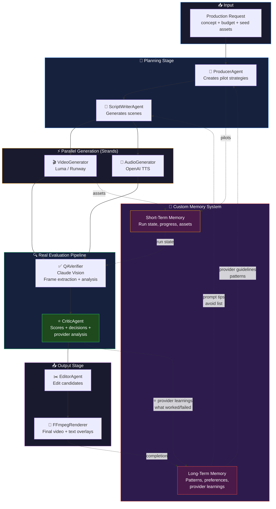

## Current State: Custom Memory System

### What We Have Now ✅

**Short-Term Memory (per run)**
- Run state and progress tracking
- Pilot decisions and scores
- Generated assets (videos, audio)
- Timeline of events
- Stored in `artifacts/runs/{id}/memory.json`

**Long-Term Memory (persists forever)**
- User preferences (style, voice, quality threshold)
- Production history (past runs, scores, costs)
- Learned patterns (intro → ANIMATED tier works well)
- **Provider Knowledge** ⭐ NEW
  - What worked: "Detailed physical descriptions"
  - What failed: "VFX transformations, magical effects"
  - Prompt tips: "Keep prompts concise, focus on photorealistic"
  - Avoid list: "Complex multi-stage effects"
- Stored in `artifacts/memory/long_term.json`

### The Learning Loop 🔄

```
1. Run starts
   ↓
2. Producer checks LTM for provider guidelines
   ↓
3. ScriptWriter uses guidelines to craft better prompts
   ↓
4. Video generated
   ↓
5. QA Verifier extracts frames, Claude Vision analyzes
   ↓
6. Critic evaluates AND analyzes provider performance
   ↓
7. Learnings written to LTM
   ↓
8. Next run benefits from learnings!
```

### Limitations

- Custom JSON file storage (not scalable)
- No semantic search over memories
- Manual serialization/deserialization
- Not integrated with Strands framework
- No conversation memory between sessions
