```mermaid
flowchart TB
    subgraph Input["📥 Input"]
        Request["Production Request<br/>concept + budget + seed assets"]
    end

    subgraph StrandsMemory["🧠 Strands Memory System"]
        subgraph ShortTerm["Short-Term Memory"]
            RunContext["Run Context<br/>Current state, decisions"]
            ConvHistory["Conversation History<br/>Agent communications"]
        end
        subgraph LongTerm["Long-Term Memory"]
            SemanticMem["Semantic Memory<br/>Searchable knowledge base"]
            EpisodicMem["Episodic Memory<br/>Past run experiences"]
            ProceduralMem["Procedural Memory<br/>Learned workflows"]
        end
        VectorStore[("🔍 Vector Store<br/>Embeddings + search")]
    end

    subgraph StrandsOrchestration["⚡ Strands Orchestration"]
        Workflow["StudioWorkflow<br/>Declarative pipeline"]
        
        subgraph Agents["Agent Pool"]
            Producer["🤖 Producer"]
            ScriptWriter["📝 ScriptWriter"]
            Video["🎬 VideoGen"]
            Audio["🎤 AudioGen"]
            QA["✅ QA"]
            Critic["⭐ Critic"]
            Editor["✂️ Editor"]
        end
        
        subgraph Patterns["Strands Patterns"]
            Parallel["parallel()"]
            Retry["@retry"]
            Timeout["@timeout"]
            Circuit["@circuit_breaker"]
        end
    end

    subgraph Output["📤 Output"]
        Renderer["🎥 Renderer"]
        Final["🎬 Final Video"]
    end

    %% Main flow
    Request --> Workflow
    Workflow --> Producer
    Producer --> ScriptWriter
    ScriptWriter --> Parallel
    Parallel --> Video
    Parallel --> Audio
    Video --> QA
    Audio --> QA
    QA --> Critic
    Critic --> Editor
    Editor --> Renderer
    Renderer --> Final

    %% Memory integration (bidirectional)
    SemanticMem <-->|"provider knowledge<br/>prompt patterns"| Producer
    SemanticMem <-->|"effective prompts<br/>style guides"| ScriptWriter
    EpisodicMem <-->|"similar past runs<br/>what worked"| Workflow
    ProceduralMem <-->|"optimized workflows<br/>best practices"| Workflow
    
    RunContext <--> Agents
    ConvHistory <--> Agents
    
    Critic -->|"learnings"| SemanticMem
    Critic -->|"run summary"| EpisodicMem
    
    VectorStore <--> SemanticMem
    VectorStore <--> EpisodicMem

    %% Styling
    style Input fill:#1a1a2e,stroke:#4a9eff,color:#fff
    style StrandsMemory fill:#2d1b4e,stroke:#e74c3c,color:#fff
    style StrandsOrchestration fill:#16213e,stroke:#f39c12,color:#fff
    style Output fill:#1a1a2e,stroke:#9b59b6,color:#fff
    
    style ShortTerm fill:#3d1a3d,stroke:#f39c12,color:#fff
    style LongTerm fill:#3d1a3d,stroke:#e74c3c,color:#fff
    style Agents fill:#1a2d4a,stroke:#4a9eff,color:#fff
    style Patterns fill:#1a3d2d,stroke:#2ecc71,color:#fff
    
    style VectorStore fill:#4a3d1a,stroke:#f39c12,color:#fff
```

## Future State: Strands Memory Integration

### Strands Memory Types

**Short-Term Memory**
- **Run Context**: Current pipeline state, in-flight decisions
- **Conversation History**: Inter-agent communications, reasoning traces
- Automatically managed by Strands within workflow execution

**Long-Term Memory**
- **Semantic Memory**: Facts and knowledge (provider capabilities, prompt patterns)
  - "Luma struggles with VFX transformations"
  - "Photorealistic scenes work best with detailed physical descriptions"
  - Searchable via embeddings
  
- **Episodic Memory**: Experiences from past runs
  - "Run X with concept Y scored 85% using these prompts"
  - "Similar concept Z failed because..."
  - Enables "remember when we did something like this?"

- **Procedural Memory**: Learned workflows and best practices
  - "For tech demos, use ANIMATED tier with 3 scenes"
  - "Always check provider guidelines before ScriptWriter"
  - Optimizes future workflow execution

### Key Improvements Over Current System

| Feature | Current (Custom) | Future (Strands) |
|---------|------------------|------------------|
| Storage | JSON files | Vector DB + structured storage |
| Search | Key lookup only | Semantic similarity search |
| Scalability | Limited | Production-ready |
| Agent Memory | Manual wiring | Built-in to agents |
| Cross-run Learning | Basic patterns | Rich episodic recall |
| Conversation | None | Full history tracking |

### Strands Memory API

```python
from strands.memory import Memory, SemanticMemory, EpisodicMemory

class StudioOrchestrator(Workflow):
    def __init__(self):
        # Initialize Strands memory
        self.memory = Memory(
            semantic=SemanticMemory(
                embedding_model="text-embedding-3-small",
                storage="local"  # or "redis", "postgres"
            ),
            episodic=EpisodicMemory(
                max_episodes=1000
            )
        )
    
    async def run(self, concept: str, budget: float, provider: str):
        # Search for relevant past experiences
        similar_runs = await self.memory.episodic.search(
            f"video production: {concept}",
            limit=3
        )
        
        # Get provider knowledge
        provider_knowledge = await self.memory.semantic.search(
            f"provider:{provider} learnings tips guidelines",
            limit=10
        )
        
        # Run pipeline with memory context
        result = await self.execute_pipeline(
            concept=concept,
            context={
                "similar_runs": similar_runs,
                "provider_guidelines": provider_knowledge
            }
        )
        
        # Record this run as an episode
        await self.memory.episodic.add(
            description=f"Production: {concept}",
            outcome=result.summary,
            learnings=result.learnings
        )
        
        # Update semantic memory with new learnings
        for learning in result.provider_learnings:
            await self.memory.semantic.add(
                content=learning.as_text(),
                metadata={"provider": provider, "run_id": result.run_id}
            )
```

### Migration Path

1. **Phase 1**: Keep current system, add Strands memory alongside
2. **Phase 2**: Migrate LTM to Strands SemanticMemory
3. **Phase 3**: Add EpisodicMemory for run history
4. **Phase 4**: Remove custom memory, full Strands integration

### Benefits

- 🔍 **Semantic Search**: "Find prompts that worked for tech content"
- 🧠 **Richer Context**: Agents understand history, not just rules
- 📈 **Scalable**: Production-ready storage backends
- 🔄 **Automatic**: Memory management built into agent lifecycle
- 💬 **Conversational**: Remember multi-turn interactions
