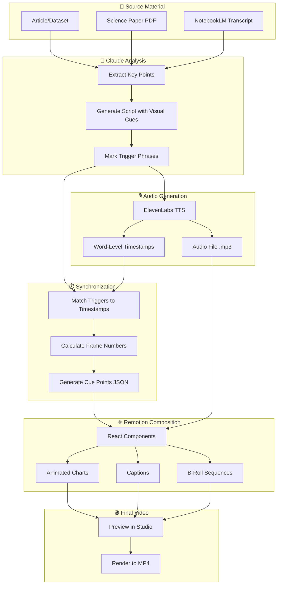
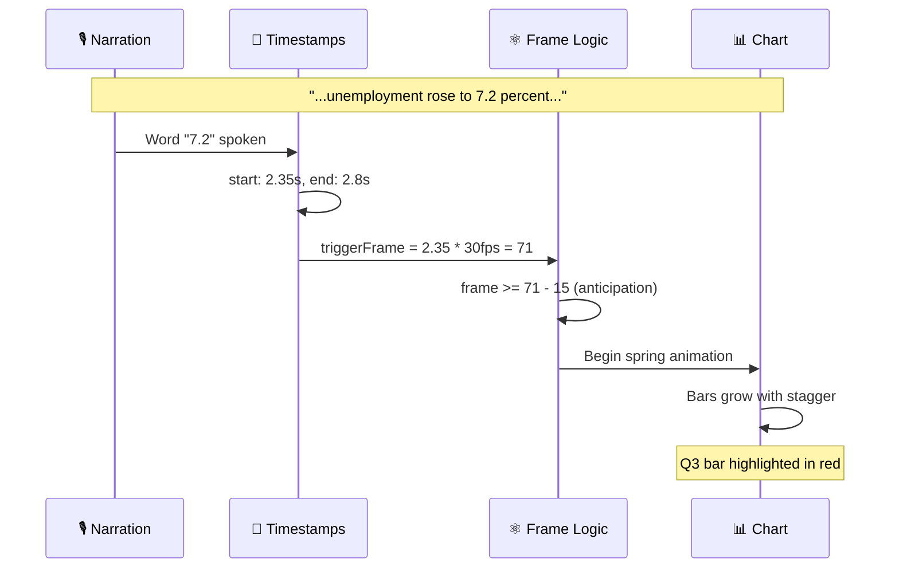

# Claude Studio + Remotion Pipeline

## Architecture Overview



## The Critical Sync Moment



## Data Flow: Script Segment → Visual Cue

```
┌─────────────────────────────────────────────────────────────────────┐
│ SCRIPT SEGMENT                                                       │
├─────────────────────────────────────────────────────────────────────┤
│ narration: "According to the latest data, unemployment rose to      │
│             7.2 percent in the third quarter."                      │
│                                                                     │
│ visualCue: {                                                        │
│   type: 'chart',                                                    │
│   trigger: '7.2 percent',  ◄─── This phrase triggers the visual    │
│   data: {                                                           │
│     chartType: 'bar',                                               │
│     values: [                                                       │
│       { label: 'Q1', value: 5.2 },                                  │
│       { label: 'Q2', value: 5.8 },                                  │
│       { label: 'Q3', value: 7.2, highlight: true }                  │
│     ]                                                               │
│   }                                                                 │
│ }                                                                   │
└─────────────────────────────────────────────────────────────────────┘
                                    │
                                    ▼
┌─────────────────────────────────────────────────────────────────────┐
│ TRANSCRIPT (from ElevenLabs)                                        │
├─────────────────────────────────────────────────────────────────────┤
│ [                                                                   │
│   { word: "According", start: 0.00, end: 0.35 },                    │
│   { word: "to",        start: 0.35, end: 0.45 },                    │
│   ...                                                               │
│   { word: "7.2",       start: 2.35, end: 2.80 },  ◄─── MATCH!      │
│   { word: "percent",   start: 2.80, end: 3.30 },                    │
│   ...                                                               │
│ ]                                                                   │
└─────────────────────────────────────────────────────────────────────┘
                                    │
                                    ▼
┌─────────────────────────────────────────────────────────────────────┐
│ CUE POINT                                                           │
├─────────────────────────────────────────────────────────────────────┤
│ {                                                                   │
│   type: 'chart',                                                    │
│   triggerPhrase: '7.2 percent',                                     │
│   startFrame: 71,  ◄─── 2.35 seconds × 30 fps                      │
│   data: { chartType: 'bar', values: [...] }                         │
│ }                                                                   │
└─────────────────────────────────────────────────────────────────────┘
                                    │
                                    ▼
┌─────────────────────────────────────────────────────────────────────┐
│ REMOTION SEQUENCE                                                   │
├─────────────────────────────────────────────────────────────────────┤
│ <Sequence from={71 - 15} layout="none">                             │
│   {/* Start 15 frames early for anticipation */}                    │
│   <AnimatedBarChart                                                 │
│     data={[                                                         │
│       { label: 'Q1', value: 5.2 },                                  │
│       { label: 'Q2', value: 5.8 },                                  │
│       { label: 'Q3', value: 7.2, highlight: true }                  │
│     ]}                                                              │
│     animationStart={15}                                             │
│   />                                                                │
│ </Sequence>                                                         │
└─────────────────────────────────────────────────────────────────────┘
```

## Component Hierarchy

```
<DataJournalismExplainer>
│
├── <Audio src="narration.mp3" />
│
├── <TitleCard>
│   └── "Quarterly Unemployment Report"
│
├── <Sequence from={56}>  ◄─── Chart appears just before stat mentioned
│   └── <AnimatedBarChart>
│       ├── <Bar label="Q1" value={5.2} delay={0} />
│       ├── <Bar label="Q2" value={5.8} delay={5} />
│       └── <Bar label="Q3" value={7.2} delay={10} highlight />
│
├── <Sequence from={180}>  ◄─── Next visual cue
│   └── <AnimatedLineChart>
│       └── <Annotation x={2008} label="Financial Crisis" />
│
├── <Sequence from={320}>
│   └── <BulletList>
│       ├── "Supply chain disruptions"
│       ├── "Interest rate hikes"
│       └── "Consumer sentiment decline"
│
└── <AnimatedCaption transcript={TRANSCRIPT} />
    └── Highlights current word, emphasizes trigger phrases
```

## Key Timing Concepts

| Concept | Value | Purpose |
|---------|-------|---------|
| **FPS** | 30 | Frames per second (industry standard) |
| **Anticipation** | 15 frames (~0.5s) | Visual appears slightly before audio trigger |
| **Stagger Delay** | 5 frames | Time between each bar starting animation |
| **Spring Damping** | 20 | Controls "bounciness" of animation |
| **Spring Stiffness** | 100 | Controls speed of animation |

## File Structure for a Generated Project

```
src/
├── compositions/
│   └── explainer/
│       ├── index.tsx           # Main composition
│       ├── transcript.json     # Word-level timestamps
│       ├── cuePoints.json      # Visual trigger data
│       └── segments/
│           ├── Intro.tsx
│           ├── StatReveal.tsx
│           └── Conclusion.tsx
│
├── components/
│   ├── charts/
│   │   ├── AnimatedBarChart.tsx
│   │   ├── AnimatedLineChart.tsx
│   │   └── AnimatedPieChart.tsx
│   ├── text/
│   │   ├── AnimatedCaption.tsx
│   │   ├── TitleCard.tsx
│   │   └── BulletList.tsx
│   └── media/
│       ├── BRollVideo.tsx
│       └── FigureReveal.tsx
│
├── utils/
│   ├── timing.ts              # secondsToFrames, findPhraseStart
│   ├── transcriptParser.ts    # Process ElevenLabs response
│   └── cuePointExtractor.ts   # Match triggers to timestamps
│
└── Root.tsx                   # Composition registry
```
